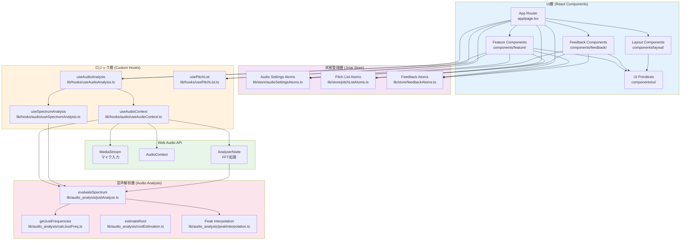
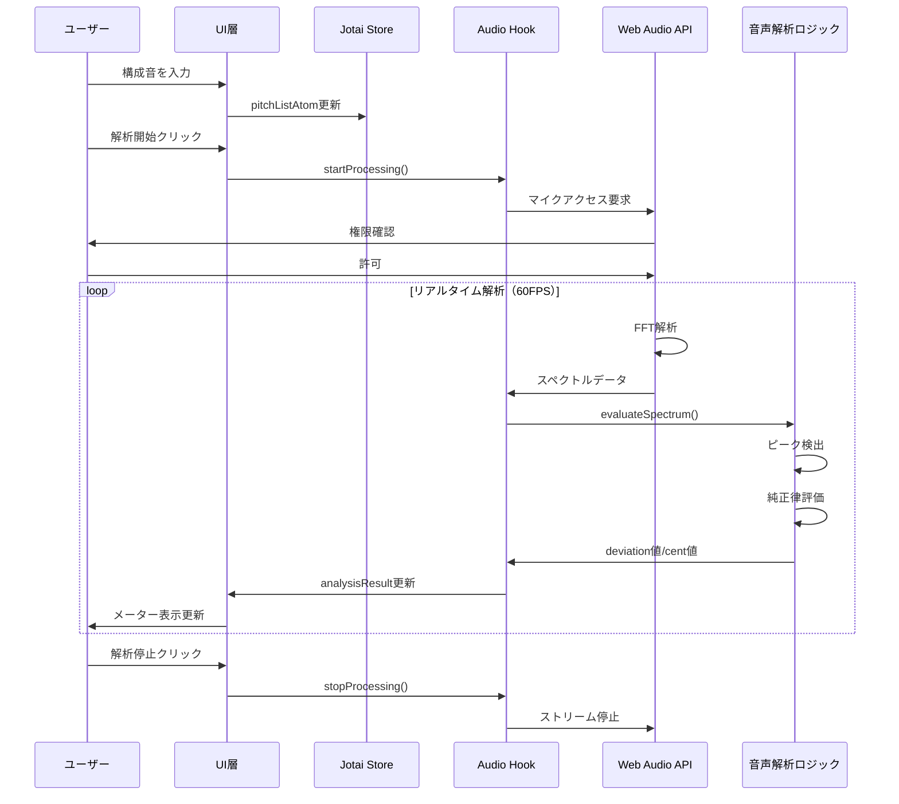
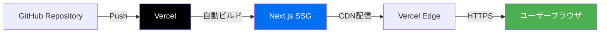

# ChordLens アーキテクチャ概要

本ドキュメントはChordLensプロジェクトの全体像を俯瞰するためのアーキテクチャガイドです。

---

## 1. システム概要

ChordLensは、マイク入力からリアルタイムで和音の純正律評価を行い、視覚フィードバックを提供するWebアプリケーションです。

### 主要な特徴
- **完全フロントエンド**: サーバー不要、ブラウザ内で完結
- **リアルタイム処理**: Web Audio APIによる低レイテンシーな音声解析
- **純正律ベース**: 平均律ではなく、純正律を基準に評価
- **PWA対応**: オフライン動作可能

---

## 2. 技術スタック

| レイヤー | 技術 | 用途 |
|---------|------|------|
| **フレームワーク** | Next.js 15 (App Router) | SPAフレームワーク |
| **UI** | React 19 | コンポーネントベースUI |
| **スタイリング** | Tailwind CSS 4 | ユーティリティファーストCSS |
| **コンポーネント** | shadcn/ui (Radix UI) | アクセシブルなUIプリミティブ |
| **状態管理** | Jotai | 軽量なアトミック状態管理 |
| **フォーム** | React Hook Form + Zod | バリデーション付きフォーム |
| **音声処理** | Web Audio API | リアルタイム音声入力・FFT解析 |
| **型安全性** | TypeScript | 静的型チェック |
| **テスト** | Jest + Testing Library | ユニット・統合テスト |
| **デプロイ** | Vercel | ホスティング・CDN |

---

## 3. アーキテクチャレイヤー



---

## 4. ディレクトリ構成

```
ChordLens-web/
├── app/                          # Next.js App Router
│   ├── page.tsx                 # メインページ
│   ├── experiment/page.tsx      # 実験モードページ
│   ├── layout.tsx               # 全体レイアウト
│   └── globals.css              # グローバルスタイル
│
├── components/                   # Reactコンポーネント
│   ├── feature/                 # 機能コンポーネント
│   │   ├── PitchSettingForm.tsx         # 構成音入力
│   │   ├── PitchList.tsx                # 構成音リスト
│   │   ├── AnalysisControl.tsx          # 解析制御
│   │   ├── CentDisplay.tsx              # セント表示
│   │   ├── SettingsForm.tsx             # 設定フォーム
│   │   ├── PresetManager.tsx            # プリセット管理
│   │   └── LogExportButton.tsx          # ログエクスポート
│   │
│   ├── feedback/                # 視覚フィードバック
│   │   ├── UnifiedFeedback.tsx          # 統合フィードバック
│   │   ├── MeterFeedback.tsx            # メーター表示
│   │   ├── BarFeedback.tsx              # バー表示
│   │   ├── CircleFeedback.tsx           # 円形表示
│   │   └── NumericFeedback.tsx          # 数値表示
│   │
│   ├── layout/                  # レイアウト
│   │   ├── MainHeader.tsx               # ヘッダー
│   │   ├── SettingsDrawer.tsx           # 設定ドロワー
│   │   └── AppFooter.tsx                # フッター
│   │
│   └── ui/                      # shadcn/ui プリミティブ
│       └── (button, input, dialog, etc.)
│
├── lib/                          # ロジック・ユーティリティ
│   ├── audio_analysis/          # 音声解析ロジック
│   │   ├── justAnalyze.ts              # スペクトル評価
│   │   ├── calcJustFreq.ts             # 純正律周波数計算
│   │   ├── rootEstimation.ts           # 根音推定
│   │   ├── pitchDetection.ts           # ピッチ検出
│   │   └── peakInterpolation.ts        # ピーク補間
│   │
│   ├── hooks/                   # カスタムフック
│   │   ├── useAudioAnalysis.ts         # 音声解析ファサード
│   │   ├── audio/
│   │   │   ├── useAudioContext.ts      # AudioContext管理
│   │   │   └── useSpectrumAnalysis.ts  # スペクトル解析
│   │   ├── usePitchList.ts             # 構成音リスト
│   │   ├── usePitchDetection.ts        # マイクピッチ検出
│   │   └── useLogRecorder.ts           # ログ記録
│   │
│   ├── store/                   # Jotai状態管理
│   │   ├── index.ts                    # エントリーポイント
│   │   ├── audioSettingsAtoms.ts       # 音声設定atoms
│   │   ├── pitchListAtoms.ts           # 構成音リストatoms
│   │   └── feedbackAtoms.ts            # フィードバックatoms
│   │
│   ├── utils/                   # ユーティリティ
│   │   ├── exportLog.ts                # ログエクスポート
│   │   └── emaHold.ts                  # EMAホールド処理
│   │
│   ├── constants.ts             # 定数定義
│   ├── types.ts                 # 型定義
│   ├── presets.ts               # プリセット管理
│   └── utils.ts                 # 共通ユーティリティ
│
├── __tests__/                    # テスト
├── public/                       # 静的ファイル
└── docs/                         # ドキュメント
    ├── ARCHITECTURE.md          # 本ドキュメント
    ├── SPECIFICATION.md         # 詳細仕様
    └── EVALUATION.md            # 評価実験ガイド
```

---

## 5. データフロー

### 5.1. 全体フロー



### 5.2. 音声解析フロー詳細

1. **マイク入力** → `MediaStream`
2. **AudioContext作成** → `useAudioContext`
3. **AnalyserNode設定** → FFTサイズ、平滑化定数
4. **スペクトル取得** → `getFloatFrequencyData()`
5. **純正律周波数計算** → `getJustFrequencies()`
6. **ピーク検出・評価** → `evaluateSpectrum()`
7. **deviation値計算** → -1.0 〜 1.0（正規化）
8. **cent値計算** → 1200 × log2(actual / expected)
9. **UI更新** → メーター、バー、円形表示

詳細は [AUDIO_PIPELINE.md](./AUDIO_PIPELINE.md) を参照。

---

## 6. 状態管理アーキテクチャ

ChordLensはJotaiを使用したアトミックな状態管理を採用しています。

### 6.1. Atoms構成

```mermaid
graph TD
    subgraph Primitive["Primitive Atoms"]
        A1[evalRangeCentsAtom]
        A2[a4FreqAtom]
        A3[fftSizeAtom]
        A4[smoothingTimeConstantAtom]
        A5[evalThresholdAtom]
        A6[holdEnabledAtom]
        A7[experimentModeAtom]
        B1[pitchListAtom]
        C1[feedbackTypeAtom]
    end

    subgraph Derived["Derived Atoms"]
        D1[sensitivityAtom]
        D2[audioSettingsAtom]
    end

    subgraph Actions["Action Atoms"]
        E1[addOrUpdatePitchAtom]
        E2[removePitchAtom]
        E3[clearPitchListAtom]
        E4[loadPresetAtom]
        E5[togglePitchEnabledAtom]
        E6[setRootAtom]
    end

    A5 --> D1
    A1 & A2 & A3 & A4 & A5 & A6 & A7 --> D2
    B1 --> E1 & E2 & E3 & E4 & E5 & E6

    style Primitive fill:#e3f2fd
    style Derived fill:#fff3e0
    style Actions fill:#fce4ec
```



### 6.2. localStorage永続化

`atomWithStorage`を使用して以下の設定を自動永続化：
- 音声設定（FFTサイズ、平滑化定数、評価範囲など）
- フィードバック表示形式

詳細は [STATE_MANAGEMENT.md](./STATE_MANAGEMENT.md) を参照。

---

## 7. 主要モジュール

### 7.1. コアフック

| フック | 責務 |
|--------|------|
| **useAudioAnalysis** | 音声解析のファサード。AudioContextとスペクトル解析を統合 |
| **useAudioContext** | Web Audio APIのセットアップ・クリーンアップ |
| **useSpectrumAnalysis** | スペクトル解析ループ、評価結果の算出 |
| **usePitchList** | 構成音リストの操作（追加、削除、プリセット） |

### 7.2. 音声解析関数

| 関数 | 責務 |
|------|------|
| **evaluateSpectrum** | スペクトルから各音の純正律評価を実施 |
| **getJustFrequencies** | 構成音から純正律周波数を計算 |
| **estimateRoot** | 和音の根音を自動推定 |
| **quadraticInterpolation** | パラボラ補間でサブビン精度の周波数推定 |

---

## 8. フィードバック表示

ChordLensは複数の視覚フィードバック形式をサポート：

| 形式 | コンポーネント | 説明 |
|------|--------------|------|
| **メーター** | `MeterFeedback` | 針が動くアナログメーター（デフォルト） |
| **バー** | `BarFeedback` | シンプルな横棒グラフ |
| **円形** | `CircleFeedback` | 12音を円周上に配置、和音の形を可視化 |
| **数値** | `NumericFeedback` | セント値の数値表示 |

`UnifiedFeedback`コンポーネントが表示形式の切り替えを制御します。

---

## 9. デプロイメント



- **ホスティング**: Vercel
- **ビルド**: Static Site Generation (SSG)
- **CDN**: Vercel Edge Network
- **URL**: https://chordlens.vercel.app/

---

## 10. 実験モード

`/experiment`ページでは以下の追加機能を提供：
- **ログ記録**: 解析結果のCSVエクスポート
- **デバッグパネル**: ピーク探索範囲の可視化
- **評価実験**: 被験者データの収集

詳細は [SPECIFICATION.md](./SPECIFICATION.md) の3.6節を参照。

---

## 11. パフォーマンス要件

| 項目 | 目標値 |
|------|--------|
| **レイテンシー** | マイク入力からメーター表示まで100ms以下 |
| **FFT処理** | 60FPS（requestAnimationFrameループ） |
| **FFT分解能** | 48kHz / 32768 ≈ 1.46 Hz |
| **メモリ使用量** | FFTバッファ約256KB |

---

## 12. ブラウザ対応

| プラットフォーム | ブラウザ | Web Audio API | getUserMedia |
|-----------------|---------|---------------|--------------|
| Windows/macOS | Chrome | ✅ | ✅ |
| macOS | Safari | ✅ | ✅ |
| iOS | Safari | ✅ | ✅ |
| Android | Chrome | ✅ | ✅ |

> [!IMPORTANT]
> HTTPS接続またはlocalhostでの使用が必須（getUserMedia APIの制約）

---

## 関連ドキュメント

- [SPECIFICATION.md](./SPECIFICATION.md) - 詳細な機能仕様
- [STATE_MANAGEMENT.md](./STATE_MANAGEMENT.md) - Jotai状態管理の詳細
- [AUDIO_PIPELINE.md](./AUDIO_PIPELINE.md) - 音声解析パイプラインの詳細
- [COMPONENTS.md](./COMPONENTS.md) - コンポーネント一覧
- [README.md](../README.md) - セットアップ・使い方
