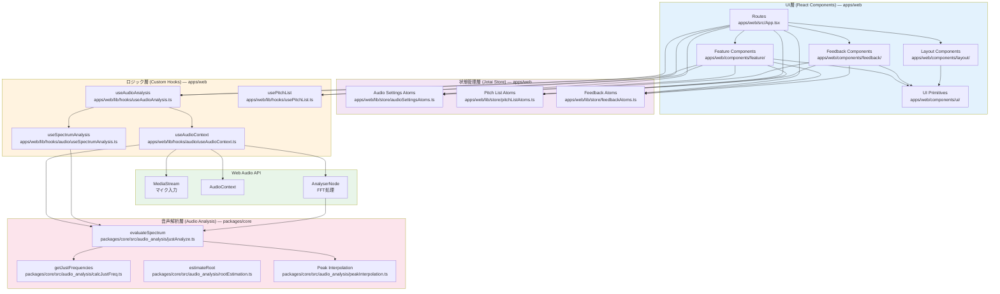
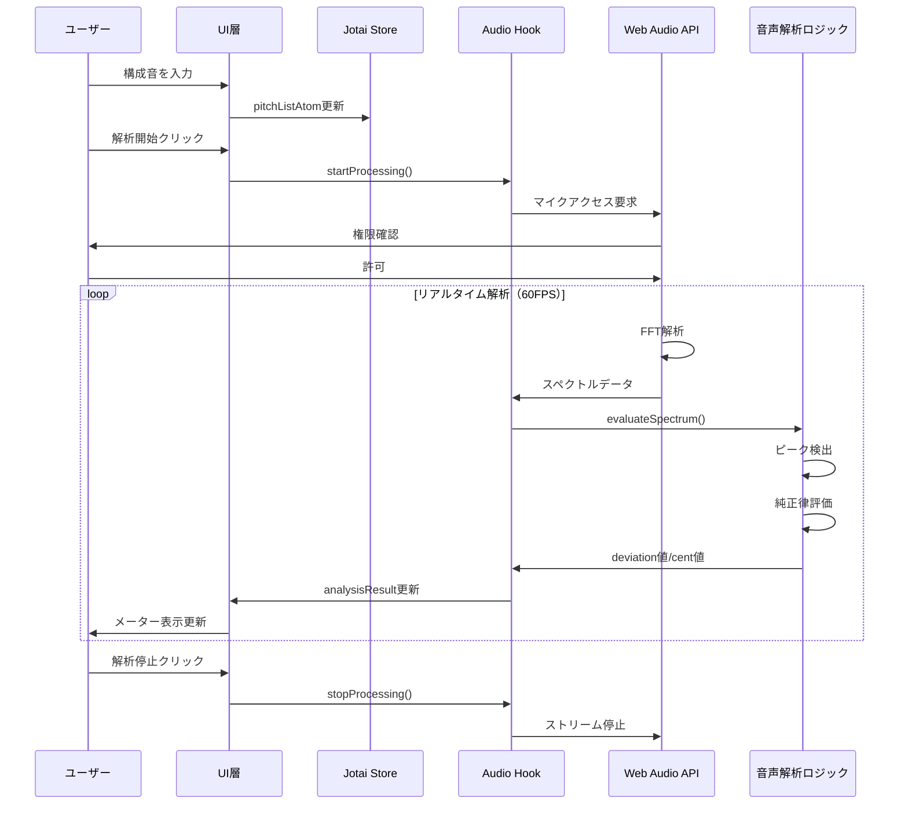
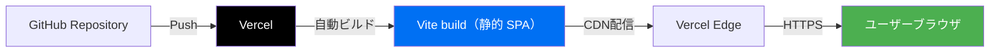

# ChordLens アーキテクチャ概要

本ドキュメントはChordLensプロジェクトの全体像を俯瞰するためのアーキテクチャガイドです。

---

## 1. システム概要

ChordLensは、マイク入力からリアルタイムで和音の純正律評価を行い、視覚フィードバックを提供するWebアプリケーションです。

### 主要な特徴
- **完全フロントエンド**: サーバー不要、ブラウザ内で完結
- **リアルタイム処理**: Web Audio APIによる低レイテンシーな音声解析
- **純正律ベース**: 平均律ではなく、純正律を基準に評価
- **PWA対応**: オフライン動作可能
- **モバイル移行を見据えた構成**: プラットフォーム非依存のコアロジック (`packages/core`) と Web アプリ (`apps/web`) を分離した monorepo（[MOBILE_MIGRATION.md](./MOBILE_MIGRATION.md) 参照）

---

## 2. 技術スタック

| レイヤー | 技術 | 用途 |
|---------|------|------|
| **リポジトリ構成** | pnpm workspaces | monorepo（apps/web + packages/core） |
| **ビルド** | Vite 6 | 開発サーバー・バンドル |
| **ルーティング** | React Router 6 | SPAルーティング |
| **UI** | React 19 | コンポーネントベースUI |
| **スタイリング** | Tailwind CSS 4 | ユーティリティファーストCSS |
| **コンポーネント** | shadcn/ui (Radix UI) | アクセシブルなUIプリミティブ |
| **状態管理** | Jotai | 軽量なアトミック状態管理 |
| **フォーム** | React Hook Form + Zod | バリデーション付きフォーム |
| **音声処理** | Web Audio API | リアルタイム音声入力・FFT解析 |
| **型安全性** | TypeScript | 静的型チェック |
| **テスト** | Vitest + Testing Library | ユニット・統合テスト |
| **PWA** | vite-plugin-pwa | オフライン対応・インストール |
| **デプロイ** | Vercel | ホスティング・CDN |

---

## 3. アーキテクチャレイヤー


```mermaid
graph TB
    subgraph UI["UI層 (React Components) — apps/web"]
        A1[Routes<br/>apps/web/src/App.tsx]
        A2[Feature Components<br/>apps/web/components/feature/]
        A3[Feedback Components<br/>apps/web/components/feedback/]
        A4[Layout Components<br/>apps/web/components/layout/]
        A5[UI Primitives<br/>apps/web/components/ui/]
    end

    subgraph State["状態管理層 (Jotai Store) — apps/web"]
        B1[Audio Settings Atoms<br/>apps/web/lib/store/audioSettingsAtoms.ts]
        B2[Pitch List Atoms<br/>apps/web/lib/store/pitchListAtoms.ts]
        B3[Feedback Atoms<br/>apps/web/lib/store/feedbackAtoms.ts]
    end

    subgraph Logic["ロジック層 (Custom Hooks) — apps/web"]
        C1[useAudioAnalysis<br/>apps/web/lib/hooks/useAudioAnalysis.ts]
        C2[useAudioContext<br/>apps/web/lib/hooks/audio/useAudioContext.ts]
        C3[useSpectrumAnalysis<br/>apps/web/lib/hooks/audio/useSpectrumAnalysis.ts]
        C4[usePitchList<br/>apps/web/lib/hooks/usePitchList.ts]
    end

    subgraph Analysis["音声解析層 (Audio Analysis) — packages/core"]
        D1[evaluateSpectrum<br/>packages/core/src/audio_analysis/justAnalyze.ts]
        D2[getJustFrequencies<br/>packages/core/src/audio_analysis/calcJustFreq.ts]
        D3[estimateRoot<br/>packages/core/src/audio_analysis/rootEstimation.ts]
        D4[Peak Interpolation<br/>packages/core/src/audio_analysis/peakInterpolation.ts]
    end

    subgraph WebAudio["Web Audio API"]
        E1[MediaStream<br/>マイク入力]
        E2[AudioContext]
        E3[AnalyserNode<br/>FFT処理]
    end

    A1 --> A2 & A3 & A4
    A2 & A3 & A4 --> A5
    A1 & A2 & A3 --> B1 & B2 & B3
    A1 & A2 --> C1 & C4
    C1 --> C2 & C3
    C2 & C3 --> D1
    D1 --> D2 & D4
    C2 --> E1 & E2 & E3
    E3 --> D1

    style UI fill:#e3f2fd
    style State fill:#f3e5f5
    style Logic fill:#fff3e0
    style Analysis fill:#fce4ec
    style WebAudio fill:#e8f5e9
```

---

## 4. ディレクトリ構成

pnpm workspaces による monorepo 構成。プラットフォーム非依存のコアロジック（`packages/core`）と
Web アプリ本体（`apps/web`）を分離しており、将来 `apps/mobile` を追加できる土台になっている。

```
chordlens/
├── pnpm-workspace.yaml           # ワークスペース定義 (apps/*, packages/*)
├── tsconfig.base.json            # 共通 TypeScript 設定
│
├── packages/
│   └── core/                     # @chordlens/core: プラットフォーム非依存コア
│       ├── src/
│       │   ├── audio_analysis/  # 音声解析ロジック（純粋 TypeScript）
│       │   │   ├── justAnalyze.ts          # スペクトル評価
│       │   │   ├── calcJustFreq.ts         # 純正律周波数計算
│       │   │   ├── rootEstimation.ts       # 根音推定
│       │   │   ├── pitchDetection.ts       # ピッチ検出（自己相関法）
│       │   │   ├── swipePitchEstimation.ts # SWIPE' ピッチ推定
│       │   │   ├── phaseVocoderEstimation.ts # 位相ボコーダ法
│       │   │   ├── peakInterpolation.ts    # ピーク補間
│       │   │   └── fft.ts                  # FFT 共通ユーティリティ
│       │   ├── adapters/        # プラットフォーム抽象インターフェース
│       │   │   ├── storage.ts              # KeyValueStorage（localStorage 等の抽象）
│       │   │   └── audio.ts                # SpectrumSource（音声入力の抽象）
│       │   ├── presets/         # プリセット管理コア（ストレージ注入式）
│       │   ├── logging/         # ログ CSV 変換
│       │   ├── utils/           # emaHold（EMA + ホールド平滑化）
│       │   ├── constants.ts     # 定数定義
│       │   ├── types.ts         # 型定義
│       │   └── index.ts         # エントリーポイント
│       ├── scripts/             # analyze-audio-file.ts（オフライン解析 CLI）
│       ├── __tests__/           # コアロジックのユニットテスト（Node 環境）
│       └── tsconfig.json        # DOM lib なし = ブラウザ API 依存を禁止
│
├── apps/
│   └── web/                      # @chordlens/web: Web アプリ (Vite + React)
│       ├── src/                 # エントリーポイント・ルーティング
│       │   ├── main.tsx
│       │   ├── App.tsx
│       │   └── routes/experiments/  # 評価実験フロー
│       ├── components/
│       │   ├── feature/         # 機能コンポーネント
│       │   ├── feedback/        # 視覚フィードバック（メーター、バー、円形）
│       │   ├── layout/          # ヘッダー・フッター・ドロワー
│       │   └── ui/              # shadcn/ui プリミティブ
│       ├── lib/                 # Web 依存のロジック
│       │   ├── hooks/           # カスタムフック（Web Audio API 使用）
│       │   ├── store/           # Jotai atoms（localStorage 永続化）
│       │   ├── experiments/     # 評価実験ロジック
│       │   ├── firebase/        # Firebase 連携
│       │   ├── presets.ts       # プリセット管理の Web バインディング
│       │   └── utils/exportLog.ts  # CSV ダウンロード（Web バインディング）
│       ├── functions/           # Cloudflare Pages Functions (client-log API)
│       ├── public/              # 静的ファイル
│       └── __tests__/           # コンポーネント・Web 依存ロジックのテスト (jsdom)
│
└── docs/                         # ドキュメント
    ├── ARCHITECTURE.md          # 本ドキュメント
    ├── SPECIFICATION.md         # 詳細仕様
    ├── MOBILE_MIGRATION.md      # モバイルアプリ移行計画
    └── EVALUATION.md            # 評価実験ガイド
```

### コア/Web の依存ルール

- `packages/core` は **DOM・ブラウザ API に依存しない**。`tsconfig.json` が DOM lib を含まないため、
  `window` / `localStorage` / Web Audio API 等を参照するとコンパイルエラーになる。
- プラットフォーム依存の処理は `packages/core/src/adapters/` のインターフェースを介して注入する
  （例: `KeyValueStorage` を実装した localStorage アダプタを `apps/web/lib/presets.ts` が注入）。
- `apps/web` からコアへは `@chordlens/core/...` で import する。逆方向の依存は禁止。

---

## 5. データフロー

### 5.1. 全体フロー


```mermaid
sequenceDiagram
    participant User as ユーザー
    participant UI as UI層
    participant Store as Jotai Store
    participant Hook as Audio Hook
    participant WebAudio as Web Audio API
    participant Logic as 音声解析ロジック

    User->>UI: 構成音を入力
    UI->>Store: pitchListAtom更新
    
    User->>UI: 解析開始クリック
    UI->>Hook: startProcessing()
    Hook->>WebAudio: マイクアクセス要求
    WebAudio->>User: 権限確認
    User->>WebAudio: 許可
    
    loop リアルタイム解析（60FPS）
        WebAudio->>WebAudio: FFT解析
        WebAudio->>Hook: スペクトルデータ
        Hook->>Logic: evaluateSpectrum()
        Logic->>Logic: ピーク検出
        Logic->>Logic: 純正律評価
        Logic->>Hook: deviation値/cent値
        Hook->>UI: analysisResult更新
        UI->>User: メーター表示更新
    end
    
    User->>UI: 解析停止クリック
    UI->>Hook: stopProcessing()
    Hook->>WebAudio: ストリーム停止
```

### 5.2. 音声解析フロー詳細

1. **マイク入力** → `MediaStream`
2. **AudioContext作成** → `useAudioContext`
3. **AnalyserNode設定** → FFTサイズ、平滑化定数
4. **スペクトル取得** → `getFloatFrequencyData()`
5. **純正律周波数計算** → `getJustFrequencies()`
6. **ピーク検出・評価** → `evaluateSpectrum()`
7. **deviation値計算** → -1.0 〜 1.0（正規化）
8. **cent値計算** → 1200 × log2(actual / expected)
9. **UI更新** → メーター、バー、円形表示

詳細は [AUDIO_PIPELINE.md](./AUDIO_PIPELINE.md) を参照。

---

## 6. 状態管理アーキテクチャ

ChordLensはJotaiを使用したアトミックな状態管理を採用しています。

### 6.1. Atoms構成


```mermaid
graph TD
    subgraph Primitive["Primitive Atoms"]
        A1[evalRangeCentsAtom]
        A2[a4FreqAtom]
        A3[fftSizeAtom]
        A4[smoothingTimeConstantAtom]
        A5[evalThresholdAtom]
        A6[holdEnabledAtom]
        A7[experimentModeAtom]
        B1[pitchListAtom]
        C1[feedbackTypeAtom]
    end

    subgraph Derived["Derived Atoms"]
        D1[sensitivityAtom]
        D2[audioSettingsAtom]
    end

    subgraph Actions["Action Atoms"]
        E1[addOrUpdatePitchAtom]
        E2[removePitchAtom]
        E3[clearPitchListAtom]
        E4[loadPresetAtom]
        E5[togglePitchEnabledAtom]
        E6[setRootAtom]
    end

    A5 --> D1
    A1 & A2 & A3 & A4 & A5 & A6 & A7 --> D2
    B1 --> E1 & E2 & E3 & E4 & E5 & E6

    style Primitive fill:#e3f2fd
    style Derived fill:#fff3e0
    style Actions fill:#fce4ec
```

### 6.2. localStorage永続化

`atomWithStorage`を使用して以下の設定を自動永続化：
- 音声設定（FFTサイズ、平滑化定数、評価範囲など）
- フィードバック表示形式

詳細は [STATE_MANAGEMENT.md](./STATE_MANAGEMENT.md) を参照。

---

## 7. 主要モジュール

### 7.1. コアフック

| フック | 責務 |
|--------|------|
| **useAudioAnalysis** | 音声解析のファサード。AudioContextとスペクトル解析を統合 |
| **useAudioContext** | Web Audio APIのセットアップ・クリーンアップ |
| **useSpectrumAnalysis** | スペクトル解析ループ、評価結果の算出 |
| **usePitchList** | 構成音リストの操作（追加、削除、プリセット） |

### 7.2. 音声解析関数

| 関数 | 責務 |
|------|------|
| **evaluateSpectrum** | スペクトルから各音の純正律評価を実施 |
| **getJustFrequencies** | 構成音から純正律周波数を計算 |
| **estimateRoot** | 和音の根音を自動推定 |
| **quadraticInterpolation** | パラボラ補間でサブビン精度の周波数推定 |

---

## 8. フィードバック表示

ChordLensは複数の視覚フィードバック形式をサポート：

| 形式 | コンポーネント | 説明 |
|------|--------------|------|
| **メーター** | `MeterFeedback` | 針が動くアナログメーター（デフォルト） |
| **バー** | `BarFeedback` | シンプルな横棒グラフ |
| **円形** | `CircleFeedback` | 12音を円周上に配置、和音の形を可視化 |
| **数値** | `NumericFeedback` | セント値の数値表示 |

`UnifiedFeedback`コンポーネントが表示形式の切り替えを制御します。

---

## 9. デプロイメント


```mermaid
graph LR
    A[GitHub Repository] -->|Push| B[Vercel]
    B -->|自動ビルド| C[Vite build（静的 SPA）]
    C -->|CDN配信| D[Vercel Edge]
    D -->|HTTPS| E[ユーザーブラウザ]
    
    style B fill:#000,color:#fff
    style C fill:#0070f3,color:#fff
    style E fill:#4caf50,color:#fff
```

- **ホスティング**: Vercel
- **ビルド**: `pnpm --filter @chordlens/web build`（Vite による静的 SPA ビルド、出力は `apps/web/dist`）
- **CDN**: Vercel Edge Network
- **URL**: https://chordlens.vercel.app/
- **補助**: `apps/web/functions/` はクライアントログ収集 API（Cloudflare Pages Functions 形式、`pnpm pages:dev` でローカル実行）

---

## 10. 実験モード

`/experiment`ページでは以下の追加機能を提供：
- **ログ記録**: 解析結果のCSVエクスポート
- **デバッグパネル**: ピーク探索範囲の可視化
- **評価実験**: 被験者データの収集

詳細は [SPECIFICATION.md](./SPECIFICATION.md) の3.6節を参照。

---

## 11. パフォーマンス要件

| 項目 | 目標値 |
|------|--------|
| **レイテンシー** | マイク入力からメーター表示まで100ms以下 |
| **FFT処理** | 60FPS（requestAnimationFrameループ） |
| **FFT分解能** | 48kHz / 32768 ≈ 1.46 Hz |
| **メモリ使用量** | FFTバッファ約256KB |

---

## 12. ブラウザ対応

| プラットフォーム | ブラウザ | Web Audio API | getUserMedia |
|-----------------|---------|---------------|--------------|
| Windows/macOS | Chrome | ✅ | ✅ |
| macOS | Safari | ✅ | ✅ |
| iOS | Safari | ✅ | ✅ |
| Android | Chrome | ✅ | ✅ |

> [!IMPORTANT]
> HTTPS接続またはlocalhostでの使用が必須（getUserMedia APIの制約）

---

## 関連ドキュメント

- [SPECIFICATION.md](./SPECIFICATION.md) - 詳細な機能仕様
- [STATE_MANAGEMENT.md](./STATE_MANAGEMENT.md) - Jotai状態管理の詳細
- [AUDIO_PIPELINE.md](./AUDIO_PIPELINE.md) - 音声解析パイプラインの詳細
- [COMPONENTS.md](./COMPONENTS.md) - コンポーネント一覧
- [README.md](../README.md) - セットアップ・使い方
