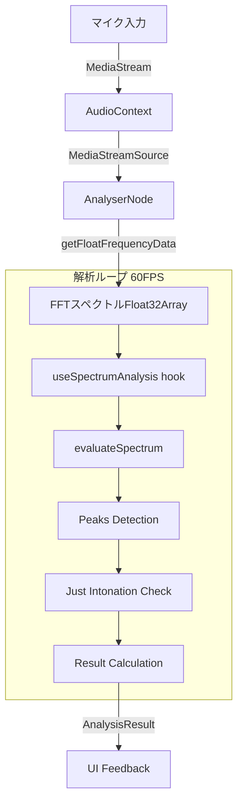

# 音声解析パイプライン (Audio Analysis Pipeline)

ChordLensの中核となる音声解析処理のフローとアルゴリズムについて解説します。

---

## 1. 処理フロー概要

Web Audio APIを使用したリアルタイム音声解析は、以下のパイプラインで処理されます。



---

## 2. Web Audio API 構成

- **AudioContext**: アプリケーション全体でシングルトンのコンテキストを管理（`useAudioContext`）
- **AnalyserNode**:
  - **FFT Size**: デフォルト `32768`（高分解能）
  - **SmoothingConstant**: デフォルト `0.8`（スペクトルの安定化）
  - **SampleRate**: 環境依存（通常44.1kHzまたは48kHz）

---

## 3. 解析アルゴリズム詳細

解析の核となるのは `lib/audio_analysis/justAnalyze.ts` 内の `evaluateSpectrum` 関数です。

### 3.1. 純正律周波数の計算 (`calcJustFreq.ts`)

まず、ユーザーが設定した「構成音」から、期待される純正律の周波数を計算します。

1. **基準周波数**: A4 = 442Hz（デフォルト）
2. **十二平均律からの変換**: 各音名の基準周波数を算出
3. **純正律比率の適用**: 根音（Root）からの純正律比率（Just Ratios）を乗算して、各構成音の理想的な周波数を決定

**純正律比率の例**:
- 完全1度: 1/1
- 長3度: 5/4
- 完全5度: 3/2

### 3.2. ピーク検出と補間 (`peakInterpolation.ts`)

FFTのビン（周波数の区切り）は離散的であるため、単純な最大値では精度が不足します。ChordLensでは**パラボラ補間（Quadratic Interpolation）**を用いて、ビン間の真のピーク周波数を推定しています。

$$
p = \frac{1}{2} \cdot \frac{\alpha - \gamma}{\alpha - 2\beta + \gamma}
$$

- $\alpha$: 左隣のビンの強度
- $\beta$: 最大ビンの強度
- $\gamma$: 右隣のビンの強度
- $p$: ピーク位置のオフセット（-0.5 〜 0.5）

これにより、FFTの解像度以上のピッチ検出精度を実現しています。

### 3.3. 評価指標の計算

検出された周波数（Actual）と期待される周波数（Expected）の差を評価します。

1. **セント差分（Cent Deviation）**:
   $$
   \text{cent} = 1200 \times \log_2\left(\frac{\text{Actual}}{\text{Expected}}\right)
   $$

2. **正規化Deviation**:
   メーター表示用に、ユーザー設定された「評価範囲（例: ±50cent）」で正規化して -1.0 〜 1.0 の値を算出します。

---

## 4. Hooks設計

### `useAudioAnalysis` (Facade)

音声解析機能の公開インターフェースです。内部の実装詳細（初期化、ループ管理、エラーハンドリング）を隠蔽し、UIコンポーネントからはシンプルに利用できるようになっています。

```typescript
const { 
  startProcessing, // 解析開始（マイク許可要求含む）
  stopProcessing,  // 解析停止
  analysisResult,  // 最新の解析結果（React State）
  isProcessing     // 動作中フラグ
} = useAudioAnalysis({ ...settings });
```

### `useSpectrumAnalysis` (Logic)

`requestAnimationFrame` を使用したメインループを管理します。

- **省電力**: 描画更新が必要なタイミングでのみ計算を実行
- **メモリ管理**: FFT用のバッファ（Float32Array）を再利用してGCを抑制

---

## 5. 実験モードとデバッグ

`/experiment` ページで有効になるデバッグ機能では、ピーク探索の様子を可視化できます。

- **ピーク探索範囲**: 期待周波数の $\pm$ 評価範囲（cent）に相当するFFTビンの範囲
- **検出ピーク**: その範囲内で最大強度を持つビンとその補間値

`PeakSearchBinsPanel` コンポーネントにより、どのビンが参照され、どこにピークが検出されたかをリアルタイムでグラフ表示し、アルゴリズムの挙動を詳細に確認できます。
