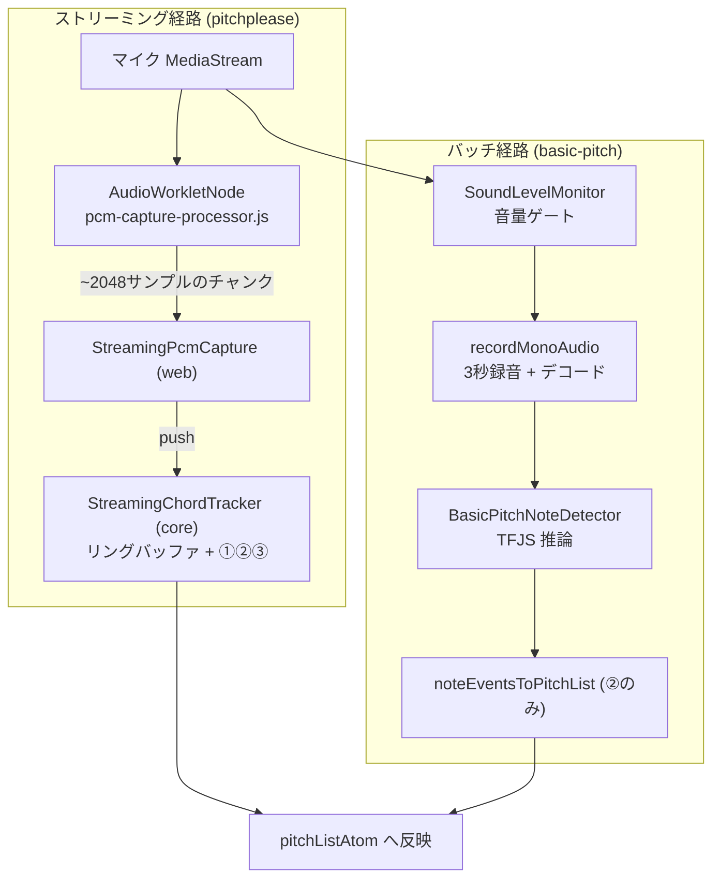
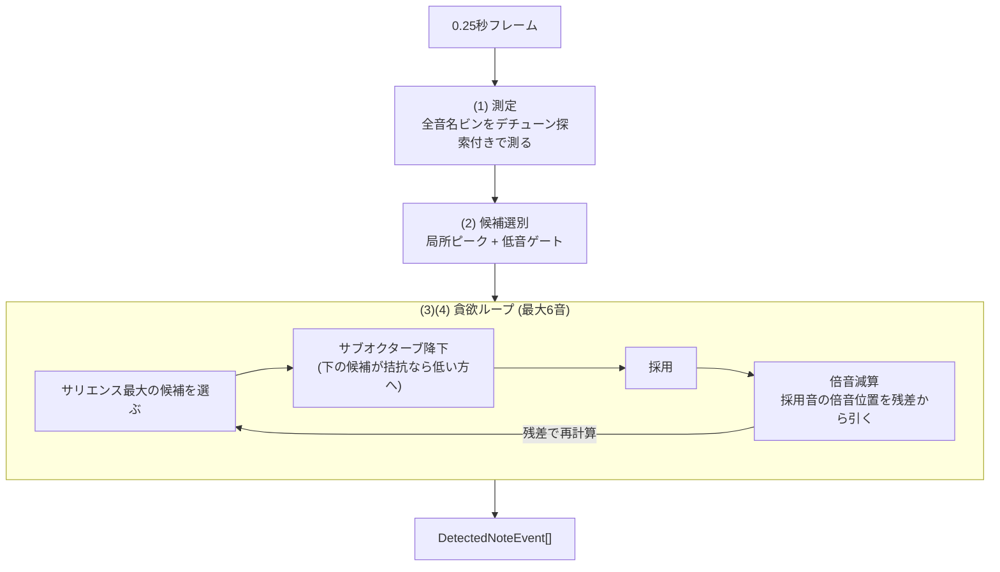
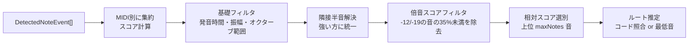

# 構成音の自動検出 (Chord Detection)

自動追従モードで使う、マイク入力からの和音構成音推定について解説します。

> **このドキュメントの読み方**: §1 で全体像 (何が・どこで・どの順に処理されるか) を
> つかんでから、必要な段の詳細 (§2〜§5) に降りてください。
> 純正律偏差の計測パイプライン ([AUDIO_PIPELINE.md](./AUDIO_PIPELINE.md)) とは
> 独立した系統で、検出結果は**音名の特定のみ**に使い、偏差の計測には使いません。

---

## 1. 全体像

### 1.1. 一言でいうと

マイクの音を 0.25 秒ごとに「どの音名が鳴っているか」判定し (フレーム解析)、
直近 1 秒の判定を多数決的に集約し (時間集約)、結果が 2 回連続で一致したら
画面に反映する (ヒステリシス)。


| 段 | 担当モジュール | 責務 | 主な誤検出対策 |
|---|---|---|---|
| ① フレーム解析 | `pitchPleaseNoteDetection.ts` (core) | 1フレームの音名判定 | 倍音和サリエンス + 貪欲減算 (§2) |
| ② 時間集約 | `chordToneEstimation.ts` (core) | スコアで構成音を選別・ルート推定 | 倍音スコアフィルタ・隣接半音解決 (§3) |
| ③ ヒステリシス | `streamingChordTracker.ts` (core) | ちらつき防止・確定判定 | 2サイクル一致 (§4) |

### 1.2. 2 つのアルゴリズムと処理経路

検出アルゴリズムは選択式で、処理経路が異なります。

| | **pitchplease** (本ドキュメントの主題) | **basic-pitch** |
|---|---|---|
| 実装 | `packages/core/src/audio_analysis/pitchPleaseNoteDetection.ts` | `apps/web/lib/audio/basicPitchNoteDetector.ts` |
| 方式 | 倍音和サリエンス + 貪欲減算 (Goertzel ベース) | TensorFlow.js モデル推論 |
| 音声取得 | AudioWorklet で生 PCM を連続取得 (ストリーミング) | MediaRecorder で 3 秒録音 (バッチ) |
| 反映レイテンシ | 典型 ~0.6 秒 | 3.5 秒以上 |
| A4 基準設定 | 追従する | 440Hz 固定 |
| プラットフォーム | 非依存 (core) | ブラウザ依存 (TFJS) |



キャプチャ (AudioWorklet) だけがブラウザ依存 (`apps/web/lib/audio/pcmCapture.ts`)、
解析ロジックはすべてプラットフォーム非依存の core にあります。
サンプルレートは AudioContext のネイティブレート (通常 44.1/48kHz) をそのまま渡し、
リサンプルは行いません (検出器内部で処理する。§2.2)。

### 1.3. 設計を決めた実データの 3 つの現実

アルゴリズムは吹奏楽器アンサンブルの実録音 (§5 の評価基盤) に対して
チューニングされています。設計を駆動した観測事実:

1. **奏者の音程は平均律格子から ±50 セント近くズレる**
   (そのズレの可視化が本アプリの目的) → デチューン探索 (§2.2)
2. **基音が倍音より弱い楽器がある** (金管の低音、クラリネットは偶数倍音がほぼ無い)
   → ビン単体でなく倍音系列全体で判定するサリエンス (§2.3)
3. **「基音より強い倍音」は振幅比較では原理的に除去できない**
   → 採用した音の倍音を残差から差し引く貪欲減算 (§2.4)

---

## 2. ① フレーム解析 (倍音和サリエンス + 貪欲減算)

`PitchPleaseNoteDetector` は候補音 (MIDI 36〜95 = C2〜B6 の 60 音) の周波数だけを
直接測る方式です (FFT の均一ビンではない)。1 フレームの処理は 4 步:



### 2.1. 無音ゲートとデシメーション

- フレーム RMS < `silenceRmsThreshold` (0.01) なら解析しない
- 32kHz 以上の入力は隣接ペア平均で 1/2 にデシメーションする。解析対象の
  最高周波数は最高候補音 B6 の 6 倍音 ≈ 11.8kHz なので 24kHz (Nyquist 12kHz)
  で足り、Goertzel のコストが半分になる (48kHz 直接 ~33ms → ~14ms/フレーム)

### 2.2. (1) 測定: Goertzel + デチューン探索

各測定周波数 f のパワー |X(f)|² は Goertzel アルゴリズム (`goertzel.ts`) で求めます:

```
coeff = 2·cos(2πf / sampleRate)          # 三角関数はここ 1 回のみ
s[n] = x[n] + coeff·s[n-1] - s[n-2]
|X(f)|² = s[N-1]² + s[N-2]² - coeff·s[N-1]·s[N-2]
```

素朴な cos/sin 内積と数学的に等価 (検証: `goertzel.test.ts`) で、
サンプルごとの三角関数評価が不要です。

**デチューン探索**: 各音名ビンは格子周波数 ±45 セントを複数オフセットで測り
最大値を採ります (`detuneOffsetsForFreq`)。刻みは DFT メインローブ幅
(≈ 1/(2·frameSeconds) Hz をセント換算) に合わせます:

| 周波数帯 | ローブ半幅 | オフセット |
|---|---|---|
| 〜77Hz (低音域) | ±45セント以上 | 0 のみ (広く探すと**隣の半音の実音を拾ってしまう**) |
| 中音域 | 15〜45セント | 0, ±ローブ幅刻み |
| 高音域 | 〜15セント | 15 セント刻みで ±45 まで |

測定グリッドは候補範囲の**上へ 31 半音 (最高候補音の 6 倍音相当)** まで拡張し
(Nyquist 未満のみ)、高音域の候補でもサリエンスが計算できるようにします。
正規化は候補範囲内の最大パワーを基準にした振幅スケール `√(P/maxP)` です。

**フレーム長 0.25 秒の根拠**: メインローブ幅 ≈ 4Hz に対し、最低候補 C2 (~65Hz)
付近の半音間隔は ~4Hz。これ以上短いと低音域の隣接半音が分離できません。
時間分解能はフレーム長ではなく②③で調整します。

### 2.3. (2) 候補選別

基音ビンが以下を満たす音名だけが候補になります:

- **局所ピーク**: 隣接半音のビンより大きい (スペクトル漏れの除去)
- **低音ゲート**: G3 (MIDI 55) 未満は倍音サポート (2f または 3f ビン ≥ 0.15) が必須。
  実楽器の低音は必ず倍音を持つが、電源ハム (50/60Hz とその倍波) や空調・息の
  低域ランブルは半音格子に倍音が乗らないため、ここで消える。
  なお候補下限を C2 にしているのも同じ理由 (C1-B1 の格子はハム帯に重なる)

### 2.4. (3)(4) サリエンスと貪欲ループ

**サリエンス** = 候補 m の倍音系列 (1f〜6f = 半音オフセット 0, +12, +19, +24, +28, +31)
の重み付き和:

```
salience(m) = Σ_k w_k · residual[m + offset_k],   w = SALIENCE_WEIGHTS
```

基音ビンが弱くても系列全体で音の実在を判定できます (金管・クラリネット対応)。

**貪欲ループ** (最大 `maxNotesPerFrame` 音):

1. 残差からサリエンスを再計算し、最大の候補を選ぶ
2. **サブオクターブ降下**: オクターブ下 (または 12 度下) の候補のサリエンスが
   `subHarmonicDescendRatio` 倍以上なら低い方を採用する。
   倍音位置 (2f) は自身の系列 {2f, 4f, 6f} を高い重みで拾うため、真の基音と
   サリエンスが拮抗することがあり、その場合は基音側に倒す
3. 採用。イベント振幅 = 正規化サリエンス (フレーム内最大 = 1)
4. **倍音減算**: 採用音の倍音位置の残差を減算する
   - 倍音が 1 本以上立っている音 → `harmonicRichSubtract` (90%) 減算
   - 倍音がまったくない純音 → `harmonicPureSubtract` (30%) のみ
     (倍音位置のエネルギーが別の実音である可能性を残す)
   - 基音ビンは 0 に、隣接半音は以後の採用から除外 (デチューンした同じ音の漏れ)
5. サリエンスが初期最大の `salienceThreshold` 倍を下回るか、基音ビンが
   `fundamentalThreshold` 未満になったら終了

### 2.5. パラメータ一覧 (`PITCH_PLEASE_DEFAULTS`)

| パラメータ | 値 | 意味 |
|---|---|---|
| `minMidiNote` / `maxMidiNote` | 36 (C2) / 95 (B6) | 候補範囲 (下限はハム対策) |
| `frameSeconds` | 0.25 | フレーム長 (低音分離の下限) |
| `fundamentalThreshold` | 0.15 | 候補の基音ビンに要求する正規化振幅 |
| `salienceThreshold` | 0.3 | 採用を打ち切るサリエンス比 |
| `harmonicRichSubtract` / `harmonicPureSubtract` | 0.9 / 0.3 | 倍音位置の減算率 |
| `subHarmonicDescendRatio` | 0.85 | サブオクターブ降下の拮抗判定 |
| `maxNotesPerFrame` | 6 | 1 フレームの最大採用数 |
| `SALIENCE_WEIGHTS` (定数) | [1, 0.6, 0.45, 0.35, 0.3, 0.25] | 倍音重み (1f〜6f) |
| `DETUNE_COVER_CENTS` (定数) | 45 | デチューン探索のカバー幅 |
| `LOW_NOTE_SUPPORT_MAX_MIDI` (定数) | 55 (G3) | 低音ゲートの適用上限 |

数値パラメータは §5 の実データ評価で調整したもの。変更時は必ず再評価すること。

### 2.6. 仕様としてのトレードオフ

誤検出 (extra) の撲滅を優先した設計判断で、以下は**仕様**です:

- **オクターブ重ね (C3+C4) は低い方の音に解決される**。2f 位置のエネルギーが
  「実音の重ね」か「第 2 倍音」かはスペクトルから区別できない
- **短 2 度が同時に鳴る和音は検出できない** (§3 の隣接半音解決)
- **C2 未満の音・倍音を全く持たない低音の純音は検出しない** (低音ゲート)

---

## 3. ② 時間集約 (`noteEventsToPitchList`)

フレーム解析のイベント列を MIDI 番号ごとに集約し、
**スコア = 合計発音時間 × 最大振幅** で構成音を選別します。



- **隣接半音解決** (`resolveAdjacentSemitones`): デチューンした音はフレームによって
  上下どちらの半音に量子化されるかが揺れるため、隣接半音ペアはスコアの高い方に解決
- **倍音スコアフィルタ** (`suppressWeakHarmonicDuplicates`): フレーム段をすり抜けて
  一部フレームだけに出た倍音を刈る。X のオクターブ下 (X-12) または 12 度下 (X-19)
  が存在し `score(X) < score(下の音) × harmonicSuppressionScoreRatio` なら X を除去
- **ルート推定**: `estimateRoot` (コード定義との完全一致照合) で推定し、
  確定しなければ最低音をルートにする

| パラメータ | バッチ (3秒録音) | ストリーミング (1秒窓) | 意味 |
|---|---|---|---|
| `minTotalDurationSeconds` | 0.15 | **0.4** | 合計発音時間の下限。ストリーミングは 2 フレーム以上の継続を要求 |
| `minAmplitude` | 0.1 | 0.1 | 最大振幅の下限 |
| `relativeScoreThreshold` | 0.15 | 0.15 | 最有力音に対するスコア比の下限 |
| `maxNotes` | 6 | 6 | 採用する構成音の最大数 |
| `harmonicSuppressionScoreRatio` | 0.5 | 0.5 | 倍音スコアフィルタ |

ストリーミング用の上書きは `STREAMING_CHORD_ESTIMATION_DEFAULTS`
(`streamingChordTracker.ts`)。

---

## 4. ③ ストリーミング追従 (`StreamingChordTracker`)

PCM チャンクをリングバッファ (`float32RingBuffer.ts`) に蓄積し、0.25 秒フレームが
揃うごとに①を実行、直近 `windowSeconds` (1 秒) のイベントで②を実行します。
推定結果のキー (音名+オクターブ+ルート) が `stableCycles` (2) 回連続で一致し、
かつ現在の確定値と異なるときだけ新しい構成音リストを確定します。

### レイテンシ内訳 (frameSeconds=0.25, stableCycles=2)

```
フレーム境界待ち              ≤ 0.25 秒
minTotalDuration (2フレーム)  + 0.25 秒
ヒステリシス (+1サイクル)      + 0.25 秒
解析 + Worklet バッチ         + ~0.05 秒
────────────────────────────────
典型 ~0.6 秒 / 最悪 ~0.8 秒
```

和音の**変更**時は、旧和音のイベントがウィンドウ (1 秒) から抜けるまでの時間が
加わり、確定まで約 1 秒です。

---

## 5. 実データ評価とチューニング

### 5.1. 評価 CLI (eval:chords)

アルゴリズムの変更は必ず実録音で回帰評価します:

```bash
pnpm --filter @chordlens/core eval:chords <録音ディレクトリ> --root-optional [--verbose]
```

- 正解ラベルはファイル名末尾のブロック (例: `..._Cm_C4-Eb4-G4.webm`、先頭が根音)
- **`--root-optional`**: 根音を「任意の音」として採点する (検出しても extra に
  せず、欠けても missing にしない)。アンサンブル実験の録音は**根音奏者の有無が
  ファイルによって異なる**ため、このデータでは必須
- batch (ファイル全体を一括解析) と streaming (アプリと同じ追従経路、
  最も長く表示されていた確定値) の両方を、exact / F1 (ノート単位の
  precision・recall) / missing / extra / root=最低音率で採点する
- 共通ロジックは `scripts/lib/chordEvalLib.ts` (パラメータ探索からも利用)
- 録音は被験者データのためコミットしない (`test-data/` は gitignore 済み)

### 5.2. パラメータの調整方法

1. 録音を会場で分割する (例: TUS を調整用、YCY を検証用。機材・部屋が違うため
   過学習の検出になる)
2. 調整対象 (detector オプションの数値パラメータ + `harmonicSuppressionScoreRatio`)
   を座標降下法で探索する。目的関数は batch F1 + streaming F1
3. **探索が選んだ組み合わせを鵜呑みにせず、パラメータ 1 つずつの寄与を
   検証側で切り分ける** (アブレーション)。調整側だけ改善して検証側が悪化する
   変更は過学習なので棄却する
4. 両側で改善 (または同等) の変更だけをデフォルト値に反映する

### 5.3. 調整の実施記録 (2026-07, 60 ファイル)

座標降下法 (2 パス) の探索結果に対しアブレーションを行った結論:

| 変更 | 調整側 (TUS) | 検証側 (YCY) | 採否 |
|---|---|---|---|
| `harmonicSuppressionScoreRatio` 0.35→**0.5** | batch 改善 | batch 改善 / streaming 同等 | **採用** |
| `subHarmonicDescendRatio` 0.9→**0.85** | streaming 改善 | batch 改善 / streaming 同等 | **採用** |
| `fundamentalThreshold` 0.15→0.1 | 両方改善 | **streaming 悪化** | 棄却 (過学習) |

採用後の全 60 ファイル (根音任意採点):
**batch F1 0.925 (exact 48/60, extra 16) / streaming F1 0.932 (exact 50/60, extra 6)**。
参考: サリエンス方式導入前の旧・比率閾値方式は誤検出が batch で 96 個あった
(採点方式が異なるため直接比較は不可だが、桁が違う)。

### 5.4. 評価データの注意

- 録音には正解ラベルの音が入っていないもの (奏者の欠落・レベル過小) がある。
  タイムライン解析 (フレームごとの上位ビン表示) で確認済み。
  特に**根音はファイルによって鳴っていたりいなかったりする**ため
  `--root-optional` での採点が前提
- したがって missing の絶対値よりも **extra (誤検出) の少なさ**と F1 を重視する

---

## 6. 新しい検出アルゴリズムの追加手順

1. core の `CHORD_DETECTION_ALGORITHMS` (`constants.ts`) に名前とラベルを追加
2. `NoteDetector` (`core/adapters/noteDetection.ts`) の実装を用意
   - プラットフォーム非依存なら core に (例: `PitchPleaseNoteDetector`)
   - ブラウザ依存なら `apps/web/lib/audio/` に (例: `BasicPitchNoteDetector`)
3. `noteDetectorFactory.ts` の switch に生成処理を追加
4. フレーム単位の解析が軽量なら `supportsStreaming()` に追加
   (StreamingChordTracker 経由の低レイテンシ経路に乗る)
5. `eval:chords --root-optional` で実データ回帰評価を行う
