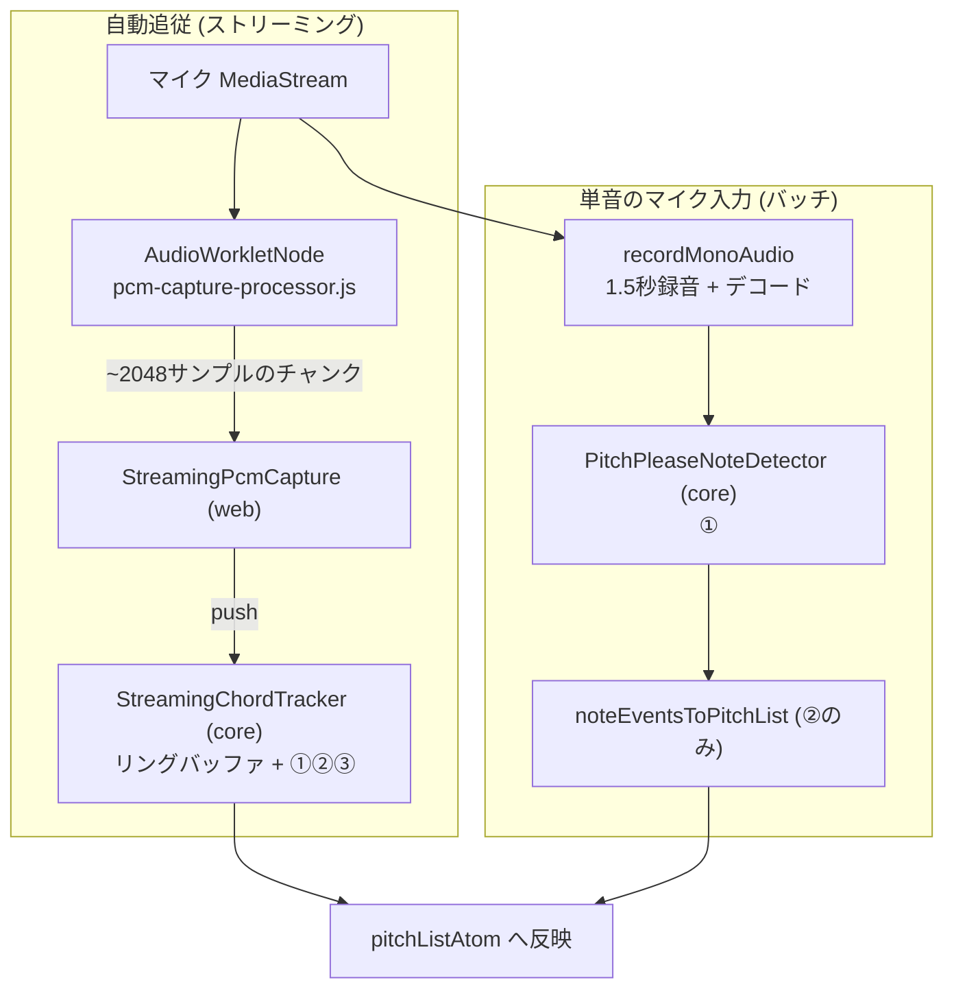
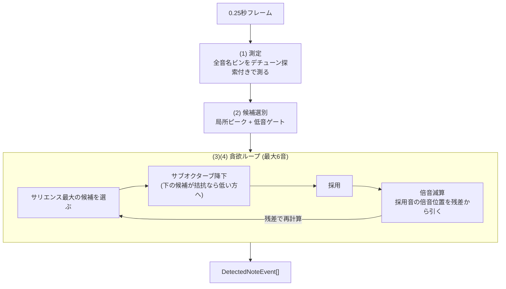
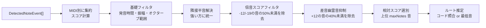

# 構成音の自動検出 (Chord Detection)

自動追従モードで使う、マイク入力からの和音構成音推定について解説します。

> **このドキュメントの読み方**: §1 で全体像 (何が・どこで・どの順に処理されるか) を
> つかんでから、必要な段の詳細 (§2〜§5) に降りてください。
> 純正律偏差の計測パイプライン ([AUDIO_PIPELINE.md](./AUDIO_PIPELINE.md)) とは
> 独立した系統で、検出結果は**音名の特定のみ**に使い、偏差の計測には使いません。

---

## 1. 全体像

### 1.1. 一言でいうと

マイクの音を 0.25 秒ごとに「どの音名が鳴っているか」判定し (フレーム解析)、
直近 1 秒の判定を多数決的に集約し (時間集約)、結果が 2 回連続で一致したら
画面に反映する (ヒステリシス)。


| 段 | 担当モジュール | 責務 | 主な誤検出対策 |
|---|---|---|---|
| ① フレーム解析 | `pitchPleaseNoteDetection.ts` (core) | 1フレームの音名判定 | 倍音和サリエンス + 貪欲減算 (§2) |
| ② 時間集約 | `chordToneEstimation.ts` (core) | スコアで構成音を選別・ルート推定 | 倍音スコアフィルタ・隣接半音解決 (§3) |
| ③ ヒステリシス | `streamingChordTracker.ts` (core) | ちらつき防止・確定判定 | 2サイクル一致 (§4) |

### 1.2. 処理経路

構成音検出は pitchplease (`PitchPleaseNoteDetector`) のみで、選択設定はありません。

| | **pitchplease** |
|---|---|
| 実装 | `packages/core/src/audio_analysis/pitchPleaseNoteDetection.ts` |
| 方式 | 倍音和サリエンス + 貪欲減算 (Goertzel ベース) |
| 音声取得 | AudioWorklet で生 PCM を連続取得 (ストリーミング) |
| 反映レイテンシ | 典型 ~0.6 秒 |
| A4 基準設定 | 追従する |
| プラットフォーム | 非依存 (core) |



> **basic-pitch の削除**: かつては @spotify/basic-pitch (TensorFlow.js) を
> 設定で選べました。TFJS 推論が重く 3 秒録音のバッチ方式でしか動かせないため、
> 反映レイテンシが 3.5 秒以上となり、リアルタイム追従に求める 1 秒未満を
> 構成上満たせません。精度でも pitchplease を下回っていた (§5.4) ため削除しました。

キャプチャ (AudioWorklet) だけがブラウザ依存 (`apps/web/lib/audio/pcmCapture.ts`)、
解析ロジックはすべてプラットフォーム非依存の core にあります。
サンプルレートは AudioContext のネイティブレート (通常 44.1/48kHz) をそのまま渡し、
リサンプルは行いません (検出器内部で処理する。§2.2)。

### 1.3. 設計を決めた実データの 3 つの現実

アルゴリズムは吹奏楽器アンサンブルの実録音 (§5 の評価基盤) に対して
チューニングされています。設計を駆動した観測事実:

1. **奏者の音程は平均律格子から ±50 セント近くズレる**
   (そのズレの可視化が本アプリの目的) → デチューン探索 (§2.2)
2. **基音が倍音より弱い楽器がある** (金管の低音、クラリネットは偶数倍音がほぼ無い)
   → ビン単体でなく倍音系列全体で判定するサリエンス (§2.3)
3. **「基音より強い倍音」は振幅比較では原理的に除去できない**
   → 採用した音の倍音を残差から差し引く貪欲減算 (§2.4)

---

## 2. ① フレーム解析 (倍音和サリエンス + 貪欲減算)

`PitchPleaseNoteDetector` は候補音 (MIDI 36〜95 = C2〜B6 の 60 音) の周波数だけを
直接測る方式です (FFT の均一ビンではない)。1 フレームの処理は 4 步:



### 2.1. 無音ゲートとデシメーション

- フレーム RMS < `silenceRmsThreshold` (0.01) なら解析しない
- 32kHz 以上の入力は隣接ペア平均で 1/2 にデシメーションする。解析対象の
  最高周波数は最高候補音 B6 の 6 倍音 ≈ 11.8kHz なので 24kHz (Nyquist 12kHz)
  で足り、Goertzel のコストが半分になる (48kHz 直接 ~33ms → ~14ms/フレーム)

### 2.2. (1) 測定: Goertzel + デチューン探索

各測定周波数 f のパワー |X(f)|² は Goertzel アルゴリズム (`goertzel.ts`) で求めます:

```
coeff = 2·cos(2πf / sampleRate)          # 三角関数はここ 1 回のみ
s[n] = x[n] + coeff·s[n-1] - s[n-2]
|X(f)|² = s[N-1]² + s[N-2]² - coeff·s[N-1]·s[N-2]
```

素朴な cos/sin 内積と数学的に等価 (検証: `goertzel.test.ts`) で、
サンプルごとの三角関数評価が不要です。既定 (noiseFloor モード) では
Goertzel の前にフレームへ Hann 窓を掛けます (後述)。

**デチューン探索**: 各音名ビンは格子周波数 ±45 セントを複数オフセットで測り
最大値を採ります (`detuneOffsetsForFreq`)。刻みは DFT メインローブ半幅
(矩形窓 ≈ 1/(2·frameSeconds) Hz、Hann 窓はメインローブが約 2 倍広いため
≈ 1/frameSeconds Hz) をセント換算した値に合わせます:

| 周波数帯 (矩形窓 = frameMax 基準) | ローブ半幅 | オフセット |
|---|---|---|
| 〜77Hz (低音域) | ±45セント以上 | 0 のみ (広く探すと**隣の半音の実音を拾ってしまう**) |
| 中音域 | 15〜45セント | 0, ±ローブ幅刻み |
| 高音域 | 〜15セント | 15 セント刻みで ±45 まで |

既定の noiseFloor モードは Hann 窓でメインローブが約 2 倍広いため、
上表の帯域境界もそれぞれ高域側にシフトする (0 のみを使う低音域が広がる)。

測定グリッドは候補範囲の**上へ 31 半音 (最高候補音の 6 倍音相当)** まで拡張し
(Nyquist 未満のみ)、高音域の候補でもサリエンスが計算できるようにします。

**正規化 (`normalizationMode`)**: 2 方式があり既定は **noiseFloor**:

- **noiseFloor (既定)**: フレームに Hann 窓を掛けてから測る (矩形窓の
  緩やかなサイドローブ減衰 -6dB/oct を Hann の -18dB/oct に置き換え、強い音の
  遠くの倍音位置がスペクトル漏れで「床から浮いた孤立ビン」になるのを防ぐ)。
  各ビンを dB 化し、MIDI 軸上 ±`floorWindowSemitones` (6) 半音窓の分位点
  (`floorPercentile` 0.5 = 中央値) をそのビンのノイズ床とし、床からの SNR を
  `headroomDb` (40dB) で 0〜1 に正規化する:
  `amplitude = clamp((P_dB − floor_dB) / headroomDb, 0, 1)`。
  さらに床のケイリング (`maxDynamicRangeDb` 45dB): フレーム内最大パワーから
  45dB を超えて低い床は `frameMaxDb - 45dB` まで切り上げる (実音が疎な高音域で
  床が過小推定され、アーティファクトの SNR が過大評価されるのを防ぐ)。
  大音量奏者がいても他奏者の基音の相対的な強さが埋もれない
- **frameMax (旧実装)**: 矩形窓のまま測り、候補範囲内の最大パワーを基準にした
  振幅スケール `√(P/maxP)` で正規化する。比較実験用に残す

**フレーム長 0.25 秒の根拠**: メインローブ幅 ≈ 4Hz に対し、最低候補 C2 (~65Hz)
付近の半音間隔は ~4Hz。これ以上短いと低音域の隣接半音が分離できません。
時間分解能はフレーム長ではなく②③で調整します。

### 2.3. (2) 候補選別

基音ビンが以下を満たす音名だけが候補になります:

- **局所ピーク**: 隣接半音のビンより大きい (スペクトル漏れの除去)
- **低音ゲート**: G3 (MIDI 55) 未満は倍音サポート (2f または 3f ビン ≥ 0.15) が必須。
  実楽器の低音は必ず倍音を持つが、電源ハム (50/60Hz とその倍波) や空調・息の
  低域ランブルは半音格子に倍音が乗らないため、ここで消える。
  なお候補下限を C2 にしているのも同じ理由 (C1-B1 の格子はハム帯に重なる)

### 2.4. (3)(4) サリエンスと貪欲ループ

**サリエンス** = 候補 m の倍音系列 (1f〜6f = 半音オフセット 0, +12, +19, +24, +28, +31)
の重み付き和:

```
salience(m) = Σ_k w_k · residual[m + offset_k],   w = SALIENCE_WEIGHTS
```

基音ビンが弱くても系列全体で音の実在を判定できます (金管・クラリネット対応)。

**貪欲ループ** (最大 `maxNotesPerFrame` 音):

1. 残差からサリエンスを再計算し、最大の候補を選ぶ
2. **サブオクターブ降下**: オクターブ下 (または 12 度下) の候補について、
   その基音ビンが `DESCEND_FUNDAMENTAL_MIN` (noiseFloor: 0.30 / frameMax: 0.15、
   通常の採用閾値よりやや高い) 以上、かつサリエンスが `subHarmonicDescendRatio`
   倍以上なら低い方を採用する。倍音位置 (2f) は自身の系列 {2f, 4f, 6f} を
   高い重みで拾うため、真の基音とサリエンスが拮抗することがあり、
   その場合は基音側に倒す
3. 採用。イベント振幅 = 正規化サリエンス (フレーム内最大 = 1)
4. **倍音減算**: 採用音の倍音位置の残差を減算する。減算対象の倍音次数は
   サリエンス計算 (1f〜6f) と独立で、noiseFloor モードは 1f〜12f まで拡張する
   (床基準 SNR では強い音の 7 次以上の実在倍音が Hann 窓越しでも床から浮き、
   幽霊音として誤検出されうるため。frameMax モードは 1f〜6f のまま)
   - 倍音が 1 本以上立っている音 → `harmonicRichSubtract` (90%) 減算
   - 倍音がまったくない純音 → `harmonicPureSubtract` (30%) のみ
     (倍音位置のエネルギーが別の実音である可能性を残す)
   - 基音ビンは 0 に、隣接半音は以後の採用から除外 (デチューンした同じ音の漏れ)
5. サリエンスが初期最大の `salienceThreshold` 倍を下回るか、基音ビンが
   `fundamentalThreshold` 未満になったら終了

### 2.5. パラメータ一覧 (`PITCH_PLEASE_DEFAULTS`)

| パラメータ | 値 | 意味 |
|---|---|---|
| `minMidiNote` / `maxMidiNote` | 36 (C2) / 95 (B6) | 候補範囲 (下限はハム対策) |
| `frameSeconds` | 0.25 | フレーム長 (低音分離の下限) |
| `normalizationMode` | noiseFloor (既定) / frameMax (比較用) | 音名ビンの正規化方式 |
| `floorPercentile` | 0.5 | noiseFloor: 床推定の分位点 (中央値) |
| `floorWindowSemitones` | 6 | noiseFloor: 床推定の MIDI 軸近傍窓幅 (半音、片側) |
| `headroomDb` | 40 | noiseFloor: 振幅 1.0 に相当する床からの SNR (dB) |
| `maxDynamicRangeDb` | 45 | noiseFloor: 床のケイリング (frameMaxDb からこれ以上下がった床を切り上げ) |
| `fundamentalThreshold` | 0.20 | 候補の基音ビンに要求する正規化振幅 (noiseFloor では床から 8dB 上相当) |
| `salienceThreshold` | 0.3 | 採用を打ち切るサリエンス比 |
| `harmonicRichSubtract` / `harmonicPureSubtract` | 0.9 / 0.3 | 倍音位置の減算率 |
| `subHarmonicDescendRatio` | 0.85 | サブオクターブ降下の拮抗判定 |
| `DESCEND_FUNDAMENTAL_MIN` (定数) | noiseFloor: 0.30 / frameMax: 0.15 | サブオクターブ降下の対象に要求する基音ビンの下限 |
| `maxNotesPerFrame` | 6 | 1 フレームの最大採用数 |
| `SALIENCE_WEIGHTS` (定数) | [1, 0.6, 0.45, 0.35, 0.3, 0.25] | 倍音重み (1f〜6f、サリエンス計算用) |
| `SUBTRACT_SEMITONE_OFFSETS` (定数) | noiseFloor: 1f〜12f / frameMax: 1f〜6f | 倍音減算の対象次数 |
| `DETUNE_COVER_CENTS` (定数) | 45 | デチューン探索のカバー幅 |
| `LOW_NOTE_SUPPORT_MAX_MIDI` (定数) | 55 (G3) | 低音ゲートの適用上限 |

数値パラメータは §5 の実データ評価で調整したもの。変更時は必ず再評価すること。

### 2.6. 仕様としてのトレードオフ

誤検出 (extra) の撲滅を優先した設計判断で、以下は**仕様**です:

- **オクターブ重ね (C3+C4) は低い方の音に解決される**。2f 位置のエネルギーが
  「実音の重ね」か「第 2 倍音」かはスペクトルから区別できない
- **短 2 度が同時に鳴る和音は検出できない** (§3 の隣接半音解決)
- **C2 未満の音・倍音を全く持たない低音の純音は検出しない** (低音ゲート)
- **最大奏者より 45dB (`maxDynamicRangeDb`) 以上弱い音は検出できない**。
  noiseFloor 正規化の床ケイリングによる仕様上の上限

**noiseFloor 正規化が単体では成立しない理由**: frameMax 正規化 (フレーム内
最大パワー基準) は、信号比例で生じるアーティファクト (窓のサイドローブ・
相互変調積・高次倍音) を暗黙に抑制する副作用を兼ねていた。noiseFloor
正規化 (ノイズ床基準の SNR) はこの暗黙の抑制を外すため、単独ではアーティ
ファクトが露出して誤検出が急増する (§5.5 のアブレーション参照)。Hann 窓・
倍音減算 1f〜12f 拡張・床の最大比ケイリングの 3 点セットで初めて frameMax
相当以上の精度に到達する。

---

## 3. ② 時間集約 (`noteEventsToPitchList`)

フレーム解析のイベント列を MIDI 番号ごとに集約し、
**スコア = 合計発音時間 × 最大振幅** で構成音を選別します。



- **隣接半音解決** (`resolveAdjacentSemitones`): デチューンした音はフレームによって
  上下どちらの半音に量子化されるかが揺れるため、隣接半音ペアはスコアの高い方に解決
- **倍音スコアフィルタ** (`suppressWeakHarmonicDuplicates`): フレーム段をすり抜けて
  一部フレームだけに出た倍音を刈る。X のオクターブ下 (X-12) または 12 度下 (X-19)
  が存在し `score(X) < score(下の音) × harmonicSuppressionScoreRatio` なら X を除去
- **差音幽霊音抑制** (`suppressSubOctaveGhosts`, `subOctaveSuppressionScoreRatio`):
  純正五度の 2 音 (根音 + 完全 5 度上) が録音系の非線形性で生む差音
  (根音の 1 オクターブ下の幽霊音) を除去する対称フィルタ。音 X の 12 半音上
  (X+12) が検出リストにあり `score(X) < score(X+12) × subOctaveSuppressionScoreRatio`
  なら X を除去する。コアの既定は 0 (無効) だが、pitchplease 推奨オプション
  (`PITCH_PLEASE_ESTIMATION_OPTIONS` / `STREAMING_CHORD_ESTIMATION_DEFAULTS`) は
  batch・streaming とも 0.4 を使う
- **ルート推定**: `estimateRoot` (コード定義との完全一致照合) で推定し、
  確定しなければ最低音をルートにする

**集約方式 (`scoreMode`)**: 既定は `durationAmplitude` (二値採択の合計発音時間×
最大振幅、上表の方式)。`medianSalience` (連続サリエンス + provisional 標本の
時間中央値、閾値境界の採択揺れに頑健) はオプションとして残る。一時期
batch の既定にしていたが、noiseFloor 正規化でフレーム単位の採択が安定した
結果不要となり撤回した (経緯は §5.5)。

| パラメータ | バッチ (3秒録音) | ストリーミング (1秒窓) | 意味 |
|---|---|---|---|
| `minTotalDurationSeconds` | 0.15 | **0.4** | 合計発音時間の下限。ストリーミングは 2 フレーム以上の継続を要求 |
| `minAmplitude` | 0.1 | 0.1 | 最大振幅の下限 |
| `relativeScoreThreshold` | 0.15 | 0.15 | 最有力音に対するスコア比の下限 |
| `maxNotes` | 6 | 6 | 採用する構成音の最大数 |
| `harmonicSuppressionScoreRatio` | 0.5 | 0.5 | 倍音スコアフィルタ |
| `subOctaveSuppressionScoreRatio` | 0.4 (pitchplease推奨) | 0.4 (pitchplease推奨) | 差音幽霊音抑制 (コア既定は 0 = 無効) |

ストリーミング用の上書きは `STREAMING_CHORD_ESTIMATION_DEFAULTS`
(`streamingChordTracker.ts`)。

---

## 4. ③ ストリーミング追従 (`StreamingChordTracker`)

PCM チャンクをリングバッファ (`float32RingBuffer.ts`) に蓄積し、0.25 秒フレームが
揃うごとに①を実行、直近 `windowSeconds` (1 秒) のイベントで②を実行します。
推定結果のキー (音名+オクターブ+ルート) が `stableCycles` (2) 回連続で一致し、
かつ現在の確定値と異なるときだけ新しい構成音リストを確定します。

### レイテンシ内訳 (frameSeconds=0.25, stableCycles=2)

```
フレーム境界待ち              ≤ 0.25 秒
minTotalDuration (2フレーム)  + 0.25 秒
ヒステリシス (+1サイクル)      + 0.25 秒
解析 + Worklet バッチ         + ~0.05 秒
────────────────────────────────
典型 ~0.6 秒 / 最悪 ~0.8 秒
```

和音の**変更**時は、旧和音のイベントがウィンドウ (1 秒) から抜けるまでの時間が
加わり、確定まで約 1 秒です。

### 無音判定

`poll()` が返す `StreamingChordUpdate.silent` は、直近フレームの検出イベントが
1 つもないか、あっても**全て provisional (採択閾値未満の候補標本)** のときに
true になる。provisional は medianSalience 集約用の緩い標本 (§3) であり、
確定検出が 1 つもないという意味では従来の「イベント数 0」と同じ扱いにする。

---

## 5. 実データ評価とチューニング

### 5.1. 評価 CLI (eval:chords)

アルゴリズムの変更は必ず実録音で回帰評価します:

```bash
pnpm --filter @chordlens/core eval:chords <録音ディレクトリ> --root-optional [--verbose]

# レベル不均衡 (1人だけ弱い/欠けた演奏) への耐性を評価する
pnpm --filter @chordlens/core eval:chords <録音ディレクトリ> --root-optional --attenuate 6
pnpm --filter @chordlens/core eval:chords <録音ディレクトリ> --root-optional --attenuate 12
```

**追加オプション**:

- **`--attenuate <dB>`**: レベル不均衡 augmentation。正解音を 1 音ずつ、
  その倍音帯域 (1f〜6f、±45c フルゲイン/±60c まで raised-cosine 遷移) だけを
  全ファイル 1 回の FFT でノッチ減衰した変異体を作って評価する
  (`scripts/lib/spectralAttenuation.ts`)。他の正解音の同帯域は保護され
  減衰されない。ファイル数 × 正解音数ぶんの変異体が採点されるため、
  61 ファイルの評価では n=122 になる (根音任意採点で根音を除いた場合)
- **`--window-seconds <秒>`**: streaming 経路の `StreamingChordTracker` の
  `windowSeconds` を上書きする (省略時は既定の 1.0 秒)
- 会場別 (ファイル名の会場セグメント、例 TUS/YCY) の F1 内訳が自動的に
  出力に付く

- 正解ラベルはファイル名末尾のブロック (例: `..._Cm_C4-Eb4-G4.webm`、先頭が根音)
- **`--root-optional`**: 根音を「任意の音」として採点する (検出しても extra に
  せず、欠けても missing にしない)。アンサンブル実験の録音は**根音奏者の有無が
  ファイルによって異なる**ため、このデータでは必須
- batch (ファイル全体を一括解析) と streaming (アプリと同じ追従経路、
  最も長く表示されていた確定値) の両方を、exact / F1 (ノート単位の
  precision・recall) / missing / extra / root=最低音率で採点する
- 音声のデコードレートは `--sample-rate` の指定値 (既定 48000)
- 実装は `scripts/lib/chordEvalCli.ts` (引数解析・評価ループ・レポート) と
  `scripts/lib/chordEvalLib.ts` (デコード・採点・集計。パラメータ探索からも利用)。
  別の検出器を比較したい場合は `EvalOptions.createDetector` で注入する
- 録音は被験者データのためコミットしない (`test-data/` は gitignore 済み)

### 5.2. パラメータの調整方法

1. 録音を会場で分割する (例: TUS を調整用、YCY を検証用。機材・部屋が違うため
   過学習の検出になる)
2. 調整対象 (detector オプションの数値パラメータ + `harmonicSuppressionScoreRatio`)
   を座標降下法で探索する。目的関数は batch F1 + streaming F1
3. **探索が選んだ組み合わせを鵜呑みにせず、パラメータ 1 つずつの寄与を
   検証側で切り分ける** (アブレーション)。調整側だけ改善して検証側が悪化する
   変更は過学習なので棄却する
4. 両側で改善 (または同等) の変更だけをデフォルト値に反映する

### 5.3. 調整の実施記録 (2026-07, 60 ファイル)

座標降下法 (2 パス) の探索結果に対しアブレーションを行った結論:

| 変更 | 調整側 (TUS) | 検証側 (YCY) | 採否 |
|---|---|---|---|
| `harmonicSuppressionScoreRatio` 0.35→**0.5** | batch 改善 | batch 改善 / streaming 同等 | **採用** |
| `subHarmonicDescendRatio` 0.9→**0.85** | streaming 改善 | batch 改善 / streaming 同等 | **採用** |
| `fundamentalThreshold` 0.15→0.1 | 両方改善 | **streaming 悪化** | 棄却 (過学習) |

採用後の全 60 ファイル (根音任意採点):
**batch F1 0.925 (exact 48/60, extra 16) / streaming F1 0.932 (exact 50/60, extra 6)**。
参考: サリエンス方式導入前の旧・比率閾値方式は誤検出が batch で 96 個あった
(採点方式が異なるため直接比較は不可だが、桁が違う)。

### 5.4. basic-pitch との比較の実測 (2026-08, 61 ファイル) — 削除の根拠

> **この比較の結論として basic-pitch は削除済み**。以下は削除の判断根拠として
> 残す記録であり、現在のコードに basic-pitch 経路は存在しない。

当時の 2 アルゴリズムを同一データ・同一採点で比較した結果 (根音任意採点、batch 経路)。
basic-pitch はストリーミング非対応のため batch のみ。

| | exact | F1 | P | R | missing | extra (うちオクターブ違い) |
|---|---|---|---|---|---|---|
| **pitchplease** | **49/61 (80%)** | **0.926** | 0.881 | 0.975 | 3 | 16 (10) |
| basic-pitch | 45/61 (74%) | 0.920 | 0.858 | 0.992 | 1 | 20 (18) |

楽器別 exact:

| | ASax | Cl | Fl | Hr | Tb | Tp |
|---|---|---|---|---|---|---|
| pitchplease | 6/6 | 10/12 | 6/6 | **5/12** | 11/12 | 10/12 |
| basic-pitch | 6/6 | 11/12 | 4/6 | **8/12** | **6/12** | 9/12 |

一致率は 両方 OK 39 / pitchplease のみ OK 10 / basic-pitch のみ OK 6 / 両方 NG 6。
**両者は別の場所で失敗している**:

- basic-pitch の誤検出は 20 件中 18 件がオクターブ違いで、Tb が 6/12 まで落ちる
- basic-pitch だけが正解した 6 件のうち 4 件が TUS_Hr_A。これは pitchplease が
  「最弱の正解音の基音レベルがフレーム最大比 0.15 未満」で全滅するファイル群であり、
  **弱い基音の情報はスペクトルに存在していて、pitchplease の正規化・閾値設計が
  捨てているだけ**であることを示す (原理的限界ではない)

当時 pitchplease を既定にしたのは、この F1 差に加えて反映レイテンシ (~0.6 秒 vs
3.5 秒以上) と A4 設定への追従があるため。

**その後の削除 (2026-08)**: basic-pitch は TFJS 推論が重く 3 秒録音のバッチ方式
でしか動かせないため、反映レイテンシ 3.5 秒以上が構成上の下限であり、
リアルタイム追従の要件 (1 秒未満) を満たせない。§5.5 で pitchplease が全条件で
さらに改善したことで精度面の存在意義もなくなったため、実装・設定・依存
(@spotify/basic-pitch, @tensorflow/tfjs)・web 側の評価 CLI をすべて削除した。

> **注**: 上表の pitchplease の数値は noiseFloor 正規化導入前
> (frameMax 正規化 + 集約は harmonicSuppressionScoreRatio 調整後の legacy) の
> もの。導入後の再評価は §5.5 (basic-pitch 側は未再評価で、この表の数値のまま)。
> 「弱い基音の情報はスペクトルに存在していて正規化・閾値設計が捨てているだけ」
> という上の観察が、§5.5 の noiseFloor 正規化 (弱い奏者の基音を掘り起こす設計)
> の直接の動機になった。

### 5.5. 床正規化と不均衡耐性の調整記録 (2026-08, 61 ファイル)

§5.3・§5.4 のチューニングの後、2 点を追加で見直した:
(1) `--attenuate` augmentation でレベル不均衡 (1 人だけ弱い/欠けた演奏) への
耐性を評価基盤に加える、(2) frameMax 正規化 (フレーム内最大パワー基準) を
noiseFloor 正規化 (ノイズ床基準の dB SNR、§2.2) に置き換える。

**採否**:

- **採用 (1) レベル不均衡 augmentation**: `--attenuate` を評価 CLI に追加。
  1 音ずつ倍音帯域を減衰させた変異体で回帰評価できるようにした
- **採用 (2) noiseFloor 正規化**: Hann 窓 + 倍音減算 12f 拡張 + 床の最大比
  ケイリング (45dB) + `fundamentalThreshold` 0.20 のセット。個別には成立せず、
  セットで初めて成立する (下記アブレーション参照)
- **採用 (3) サブオクターブ抑制** (`subOctaveSuppressionScoreRatio` 0.4):
  純正五度の差音由来の根音 -1oct 幽霊音を集約段で除去する (§3)
- **一時採用 → 撤回: 中央値集約** (batch, `scoreMode: "medianSalience"`):
  frameMax 時代の採択揺れへの対症療法だった。noiseFloor 正規化でフレーム
  単位の採択自体が安定すると不要になり、legacy 集約 (durationAmplitude) の
  方が全評価条件で上回った (batch F1 0.930 vs 0.964)。オプション機能として
  実装は残す (§3)

**棄却したアプローチ**:

- streaming への中央値集約: 倍音残差の閾値割れが呼吸スケール (1〜2 秒) で
  自己相関し、`windowSeconds` 1.0〜2.5 秒の中央値では分離できない
  (全窓で悪化した)
- 素の noiseFloor 正規化 (矩形窓・倍音減算 6f のまま): 7f 以上の実在倍音と
  サイドローブが露出し、batch F1 が 0.637 まで崩壊した
- 床とフレーム内最大比の二重ゲート: ゴーストと真の基音の最大比分布が
  重なることを実測で確認し、分離条件として成立しなかった
- 集約段での閾値の引き上げ: YCY のゴースト誤検出 4/6 は毎フレーム確定
  検出されており、集約段のフィルタでは原理的に止められない

**評価結果 (61 ファイル、`--root-optional`。-6dB/-12dB は正解音ごとの
変異体で n=122)**:

| 条件 | 経路 | F1 | P | R | missing | extra(oct) | TUS F1 | YCY F1 |
|---|---|---|---|---|---|---|---|---|
| 原音 | batch | 0.964 | 0.938 | 0.992 | 1 | 8(7) | 0.960 | 0.969 |
| 原音 | streaming | 0.972 | 0.953 | 0.992 | 1 | 6(4) | 0.973 | 0.970 |
| -6dB | batch | 0.941 | 0.905 | 0.980 | 5 | 25(19) | 0.928 | 0.959 |
| -6dB | streaming | 0.954 | 0.933 | 0.975 | 6 | 17(11) | 0.952 | 0.954 |
| -12dB | batch | 0.924 | 0.884 | 0.967 | 8 | 31(23) | 0.906 | 0.949 |
| -12dB | streaming | 0.923 | 0.912 | 0.934 | 16 | 22(14) | 0.918 | 0.928 |

改善前 baseline (frameMax 正規化、§5.4 時点の設定): 原音 batch F1 0.926 /
streaming 0.933、-6dB 0.843/0.825、-12dB 0.760/0.733。exact (原音, 61ファイル)
は batch 49→54、streaming 51→55 に改善。

**教訓 (frameMax 正規化が兼ねていた暗黙の役割)**: frameMax 正規化は、信号
比例で生じるアーティファクト (窓のサイドローブ・相互変調積・高次倍音) を
暗黙に抑制する副作用を兼ねていた。noiseFloor 正規化への移行はこの暗黙の
抑制を外すため、Hann 窓・倍音減算 12f 拡張・床の最大比ケイリングとの
セットで初めて成立する。ケイリング 45dB は「最大奏者より 45dB 以上弱い音は
検出できない」という仕様上のトレードオフ (§2.6)。

### 5.6. 評価データの注意

- 録音には正解ラベルの音が入っていないもの (奏者の欠落・レベル過小) がある。
  タイムライン解析 (フレームごとの上位ビン表示) で確認済み。
  特に**根音はファイルによって鳴っていたりいなかったりする**ため
  `--root-optional` での採点が前提
- したがって missing の絶対値よりも **extra (誤検出) の少なさ**と F1 を重視する

---

## 6. 新しい検出アルゴリズムの追加手順

現在は pitchplease の 1 実装のみで、選択のしくみ (定数・atom・設定 UI) は
持っていません。2 つ目を入れる場合の手順:

1. `NoteDetector` (`core/adapters/noteDetection.ts`) の実装を用意する
   - プラットフォーム非依存なら core に (例: `PitchPleaseNoteDetector`)
   - ブラウザ依存なら `apps/web/lib/audio/` に置き、core から参照しない
2. `apps/web/lib/audio/noteDetectorFactory.ts` に選択の分岐を足す。
   併せて集約オプション (`BATCH_ESTIMATION_OPTIONS` 相当) を実装ごとに分ける
3. ユーザーに選ばせるなら core の定数・`chordDetectionAtoms` の永続化 atom・
   `ChordFollowToggle` の Select を復活させる (削除前の実装は git 履歴を参照)
4. ストリーミング経路に載せられるのは**フレーム単位の解析が軽い実装だけ**。
   重い推論ならバッチ専用となり、反映レイテンシが 1 秒を大きく超える点に注意
   (basic-pitch を削除した理由。§5.4)
5. `eval:chords --root-optional` で実データ回帰評価を行う。既定以外の検出器は
   `EvalOptions.createDetector` で注入する。レベル不均衡耐性 (`--attenuate 6`
   / `--attenuate 12`) も併せて確認する
