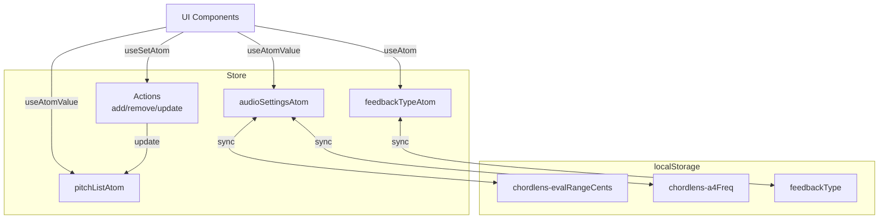

# 状態管理 (State Management)

ChordLensでは、軽量かつ柔軟な状態管理ライブラリである[Jotai](https://jotai.org/)を採用しています。各状態は「Atom」と呼ばれる単位で管理され、コンポーネント間で効率的に共有されます。

---

## 1. 状態管理の設計方針

- **アトミック性**: 状態を最小単位（Atom）に分割し、必要なコンポーネントだけが再レンダリングされるようにする
- **永続化**: ユーザー設定は`localStorage`に自動保存し、リロード後も設定を維持する
- **関心の分離**: 音声設定、構成音リスト、UI状態を個別のファイルに分割して管理する

---

## 2. Store構造

`lib/store/` ディレクトリ配下に以下のファイルで構成されています。

```
lib/store/
├── index.ts                # エントリーポイント（全Atomをエクスポート）
├── audioSettingsAtoms.ts   # 音声解析の設定（FFTサイズ、A4周波数など）
├── pitchListAtoms.ts       # 構成音リストの管理
└── feedbackAtoms.ts        # フィードバック表示設定
```

### 2.1. Audio Settings Atoms (`audioSettingsAtoms.ts`)

音声解析エンジンの挙動を制御する設定群です。すべて`atomWithStorage`を使用しており、ブラウザの`localStorage`に永続化されます。

| Atom名 | 型 | デフォルト値 | 説明 | Storage Key |
|--------|----|------------|------|-------------|
| `evalRangeCentsAtom` | `number` | `50` | 評価範囲（±セント） | `chordlens-evalRangeCents` |
| `a4FreqAtom` | `number` | `442` | 基準周波数（Hz） | `chordlens-a4Freq` |
| `fftSizeAtom` | `number` | `32768` | FFTサイズ | `chordlens-fftSize` |
| `smoothingTimeConstantAtom` | `number` | `0.8` | 平滑化定数 | `chordlens-smoothingTimeConstant` |
| `evalThresholdAtom` | `number` | `-100` | 評価閾値（dB） | `chordlens-evalThreshold` |
| `holdEnabledAtom` | `boolean` | `true` | 表示ホールド機能 | `chordlens-holdEnabled` |

**派生Atom**:
- `sensitivityAtom`: UI用の感度（0-100）と内部dB値（-60〜-140）を相互変換するRead-Write Atom。
- `experimentModeAtom`: 実験モードのON/OFF（永続化しない）。

### 2.2. Pitch List Atoms (`pitchListAtoms.ts`)

解析対象となる構成音リストを管理します。

| Atom名 | 役割 | 説明 |
|--------|------|------|
| `pitchListAtom` | State | 現在の構成音リスト（`Pitch[]`）を保持 |
| `addOrUpdatePitchAtom` | Action | 構成音を追加または更新（重複チェックあり） |
| `removePitchAtom` | Action | 指定インデックスの構成音を削除 |
| `clearPitchListAtom` | Action | リストを全消去 |
| `loadPresetAtom` | Action | プリセットからリストを一括読み込み |
| `setRootAtom` | Action | 指定した音を根音（ルート）に設定 |

### 2.3. Feedback Atoms (`feedbackAtoms.ts`)

視覚フィードバックの表示形式を管理します。

| Atom名 | 型 | デフォルト値 | Storage Key |
|--------|----|------------|-------------|
| `feedbackTypeAtom` | `Meter \| Bar \| Circle` | `"meter"` | `feedbackType` |

**カスタムストレージロジック**:
`localStorage`に不正な値が入っていた場合、アプリケーションがクラッシュしないよう、読み込み時にバリデーション（`FEEDBACK_TYPES.includes`）を行い、無効な値はデフォルト値にフォールバックします。

---

## 3. 使用例

### コンポーネントでの利用

```tsx
import { useAtom, useAtomValue, useSetAtom } from "jotai";
import { 
  a4FreqAtom, 
  pitchListAtom, 
  addOrUpdatePitchAtom 
} from "@/lib/store";

export function ExampleComponent() {
  // 値の読み取りのみ（再レンダリング最適化）
  const pitchList = useAtomValue(pitchListAtom);
  
  // 値の読み書き
  const [a4Freq, setA4Freq] = useAtom(a4FreqAtom);
  
  // 更新関数のみ（レンダリングに依存しない）
  const addPitch = useSetAtom(addOrUpdatePitchAtom);

  return (
    <div>
      <p>A4 Frequency: {a4Freq}Hz</p>
      <button onClick={() => setA4Freq(440)}>Reset A4</button>
      
      <button onClick={() => addPitch({ 
        pitchName: "C", 
        octaveNum: 4, 
        enabled: true 
      })}>
        Add C4
      </button>
    </div>
  );
}
```

### 永続化の仕組み

`atomWithStorage`を使用することで、`set`関数を呼ぶだけで自動的にlocalStorageへの書き込みが行われます。また、ページロード時にlocalStorageから初期値を復元するため、`useEffect`での手動読み込みは不要です。

```typescript
// 定義側
export const a4FreqAtom = atomWithStorage<number>("chordlens-a4Freq", 442);

// 利用側
const [freq, setFreq] = useAtom(a4FreqAtom);
setFreq(440); // -> localStorageに "chordlens-a4Freq": "440" が即座に保存される
```

---

## 4. 依存関係図


