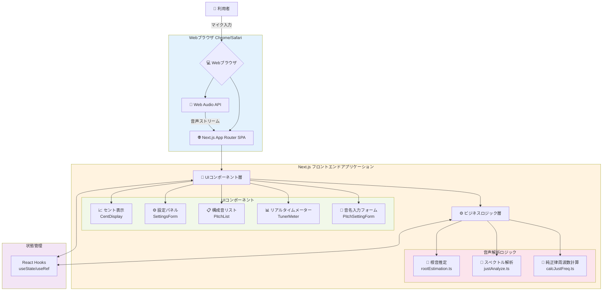
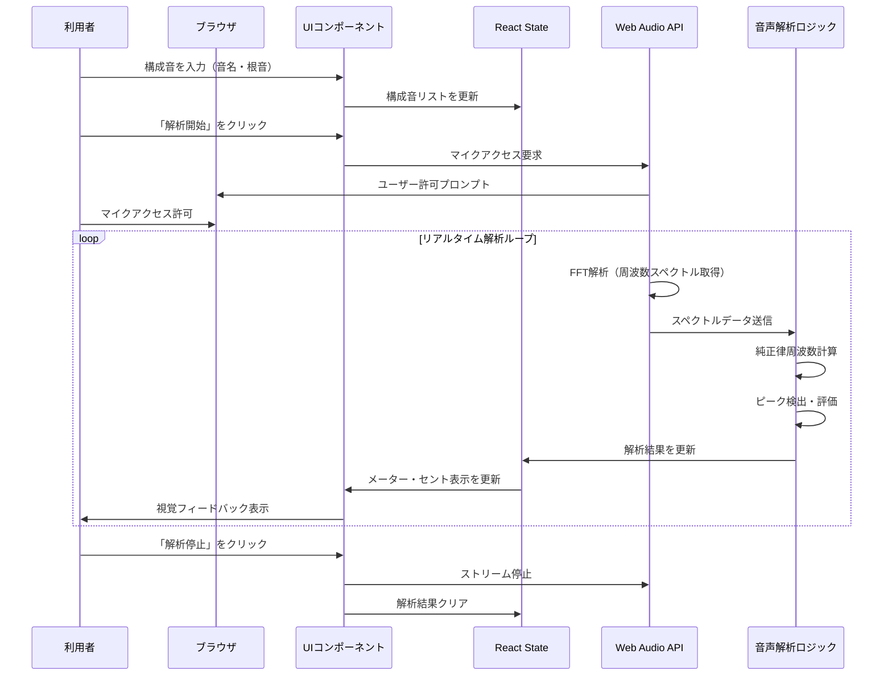
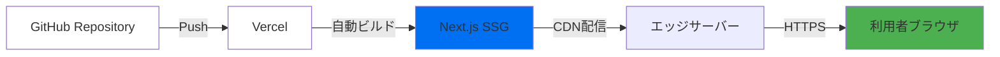

# 1. 概要

## 1.1. システムの目的

本システムは、楽器演奏初心者の、和音演奏時のピッチを純正律に合わせる練習が難しいという課題を解決することを目的とする。具体的には、システムの提供するリアルタイムな視覚フィードバックによって、和音練習の効率化・高度化を目指す。

## 1.2. 利用対象者

作音楽器の演奏者や声楽を学んでいる者

- レベルベース
    
    - アルファベットでの音名表記を理解できる者
    - 自身の聴覚に頼った純正律への調整をすることができない者
    - 自身の聴覚を使ったピッチの評価をすることができない者
- ニーズベース
    
    - 複数人での練習においても無線チューナーを使ったピッチの評価を行いたい者
    - 吹奏楽、管弦楽での指導を行う際に和音を評価する視覚的指標を必要とする者

## 1.3. 用語定義

| 用語   | 説明                                                                     |
| ------ | ------------------------------------------------------------------------ |
| 構成音 | 和音を構成する音の音名                                                   |
| 音名   | 本システムではオクターヴ番号をあわせた表記法を用いる。（例: A4 = 442Hz） |

# 2. システム構成

## 2.1. システム全体構成図



## 2.2. アーキテクチャ詳細

### 2.2.1. 技術スタック

| レイヤー              | 技術                    | 役割                            |
| --------------------- | ----------------------- | ------------------------------- |
| **フレームワーク**    | Next.js 15 (App Router) | SPAフレームワーク、ルーティング |
| **UI ライブラリ**     | React 19                | コンポーネントベースUI構築      |
| **スタイリング**      | Tailwind CSS 4          | ユーティリティファーストCSS     |
| **UI コンポーネント** | shadcn/ui (Radix UI)    | アクセシブルなプリミティブ      |
| **フォーム管理**      | React Hook Form + Zod   | バリデーション付きフォーム      |
| **音声処理**          | Web Audio API           | リアルタイム音声入力・FFT解析   |
| **状態管理**          | React Hooks             | ローカル状態管理                |
| **型安全性**          | TypeScript              | 静的型チェック                  |

### 2.2.2. ディレクトリ構成

```
ChordLens-web/                # プロジェクトルート
├── app/                      # Next.js App Router
│   ├── page.tsx             # メインページ（音声解析統合）
│   ├── layout.tsx           # 全体レイアウト
│   └── globals.css          # グローバルスタイル
├── components/              # Reactコンポーネント
│   ├── feature/             # 機能コンポーネント
│   │   ├── PitchSettingForm.tsx    # 構成音入力フォーム
│   │   ├── PitchList.tsx           # 構成音リスト表示
│   │   ├── AnalysisControl.tsx     # 解析開始/停止制御
│   │   ├── AnalysisResult.tsx      # 解析結果表示
│   │   └── SettingsForm.tsx        # 設定パネル
│   ├── TunerMeter.tsx       # メーター表示（視覚フィードバック）
│   ├── CentDisplay.tsx      # セント表示
│   ├── AppFooter.tsx        # フッター
│   └── ui/                  # shadcn/ui プリミティブ
├── lib/                     # ユーティリティ・ロジック
│   ├── audio_analysis/      # 音声解析ロジック
│   │   ├── calcJustFreq.ts         # 純正律周波数計算
│   │   ├── justAnalyze.ts          # スペクトル解析・評価
│   │   └── rootEstimation.ts       # 根音推定アルゴリズム
│   ├── constants.ts         # 定数定義
│   ├── schema.ts            # Zodスキーマ定義
│   └── utils.ts             # ユーティリティ関数
├── __tests__/               # Jestテスト
├── public/                  # 静的ファイル
├── docs/                    # ドキュメント
│   └── 仕様書.md           # 本ドキュメント
├── .github/                 # GitHub設定
│   └── copilot-instructions.md
├── package.json             # 依存関係定義
├── tsconfig.json            # TypeScript設定
├── next.config.ts           # Next.js設定
├── tailwind.config.ts       # Tailwind設定
└── jest.config.mjs          # Jest設定
```

### 2.2.3. データフロー



### 2.2.4. 主要機能とコンポーネントの対応

| 機能仕様                   | 対応コンポーネント                                         | ファイルパス                                                           |
| -------------------------- | ---------------------------------------------------------- | ---------------------------------------------------------------------- |
| **3.1 和音評価機能**       | `PitchSettingForm`  <br>`TunerMeter`  <br>`AnalysisResult` | `PitchSettingForm.tsx`  <br>`TunerMeter.tsx`  <br>`AnalysisResult.tsx` |
| **3.2 和音推定機能**       | `PitchList`                                                | `PitchList.tsx`  <br>`rootEstimation.ts`                               |
| **3.3 演奏情報**           | `CentDisplay`                                              | `CentDisplay.tsx`  <br>`calcJustFreq.ts`                               |
| **3.4 フィードバック設定** | `SettingsForm`                                             | `SettingsForm.tsx`                                                     |

### 2.2.5. Web Audio API 処理フロー


**AudioWorklet実装の詳細**:

- **AudioWorkletNode**: AnalyserNodeの代わりにカスタムプロセッサを使用
- **ワーカースレッド**: `public/audio-processor.js`でFFT処理を実行
- **メッセージパッシング**: `postMessage`でメインスレッドと通信
- **メリット**: 
  - メインスレッドをブロックせず、よりスムーズな解析
  - FFTパラメータの動的変更が可能
  - レイテンシーの削減

## 2.3. 動作環境

### 2.3.1. 対応ブラウザ

| OS          | ブラウザ      | バージョン | Web Audio API | getUserMedia |
| ----------- | ------------- | ---------- | ------------- | ------------ |
| **Windows** | Google Chrome | 最新版     | ✅             | ✅            |
| **macOS**   | Google Chrome | 最新版     | ✅             | ✅            |
| **macOS**   | Safari        | 最新版     | ✅             | ✅            |
| **iOS**     | Safari        | 最新版     | ✅             | ✅            |
| **iOS**     | Chrome        | 最新版     | ✅             | ✅            |
| **Android** | Chrome        | 最新版     | ✅             | ✅            |

### 2.3.2. 必要な権限

- **マイクアクセス権限**: Web Audio APIを使用した音声入力のため必須
- **HTTPS接続**: 本番環境ではHTTPS必須（getUserMedia APIの制約）

### 2.3.3. 推奨環境

- **CPU**: 2コア以上（FFT解析のため）
- **RAM**: 4GB以上
- **マイク**: 内蔵マイクまたは外部マイク
- **ネットワーク**: オフライン動作可能（PWA化後）

## 2.4. デプロイメント



- **ホスティング**: Vercel
- **ビルド方式**: Static Site Generation (SSG)
- **配信**: Vercel Edge Network（グローバルCDN）
- **URL**: [https://chordlens.vercel.app/](https://chordlens.vercel.app/)

# 3. 機能仕様

## 3.1. 和音評価機能（構成音入力方式）

- 機能概要 ユーザに演奏する和音の構成音を入力させる。各構成音についてメーターを表示し、ユーザに視覚的フィードバックをリアルタイムで与える。
    
- 入力
    
    - 構成音の音名と、それが和音の根音であるか
    - 音声信号
- 出力
    
    - メーターでのリアルタイムな視覚的フィードバック
- 実装詳細
    
    - **フォームバリデーション**: React Hook Form + Zodによる型安全な入力検証
    - **バリデーションルール**:
        - 音名: 必須、PITCH_NAME_LIST（C, C#, D, Eb, E, F, F#, G, G#, A, Bb, B）から選択
        - オクターブ番号: 必須、1～6の整数
        - 根音フラグ: オプション（デフォルト: false）
    - **ハイブリッド検証**:
        - Zodスキーマによるデータ型検証
        - `form.watch()`による手動検証（フォーム状態の即座な反映）
        - `isFormValid`フラグでSubmitボタンの有効/無効を制御
    - **重複チェック**: 同一音名・オクターブの構成音は上書き更新
    - **フォームリセット**: 送信後、音名は未選択、オクターブ番号は4にリセット

## 3.2. 和音推定機能

3.1. において構成音の入力の際に，どの音が根音であるか入力が必要である．本機能では，根音であるかの情報なしに根音を推定する．

- 実装詳細
    - **推定アルゴリズム**: `estimateRoot()` 関数（`lib/audio_analysis/rootEstimation.ts`）
        
    - **処理フロー**:
        
        1. 入力された音名をピッチクラス（0-11）に変換
        2. 各構成音をルート候補として全パターン検証
        3. コード定義リスト（CHORD_DEFINITIONS）と照合
        4. 最もスコアの高いコードパターンを選択
        5. 推定された根音と同じ音名の要素の`isRoot`をtrueに更新
    - **対応コードタイプ**（スコア順）:
        
        - **三和音**: Major (100), Minor (99), Sus4 (95), Sus2 (94)
        - **四和音**: Dominant 7th (80), Major 7th (79), Minor 7th (78), Minor Major 7th (75)
        - **特殊和音**: Major 6th (60), Minor 6th (59), Half-Diminished 7th (55), Diminished 7th (54), Augmented (50), Diminished (49), Minor Augmented (40)
    - **推定条件**: 構成音が2つ以上必要
        
    - **UI統合**: PitchListコンポーネントの「根音を推定」ボタンから実行
        

## 3.3. 演奏情報

- 機能概要 3.1. または 3.2. において入力された構成音に対して、演奏に必要な情報を提供する。
    
- 提供する情報
    
    - 音名
    - 音程
    - 平均律からの調整方法（cent）
- 実装詳細
    
    - **表示コンポーネント**: `CentDisplay.tsx`
        
    - **計算ロジック**: `getEqualJustDiff()` 関数（`lib/audio_analysis/calcJustFreq.ts`）
        
    - **表示内容**:
        
        - 音名とオクターブ番号（例: C4, E4, G4）
        - 色分け表示（PITCH_COLOR_MAPに基づく）
        - 平均律から純正律へのセント差（小数点以下2桁）
    - **計算方法**:
        
        1. 根音からの純正律周波数を計算（JUST_RATIOS使用）
        2. 平均律周波数を計算（12平均律）
        3. セント差 = 1200 × log2(純正律周波数 / 平均律周波数)
    - **A4周波数**: ユーザー設定可能（デフォルト: 442Hz）
        

## 3.4. フィードバック設定

- 機能概要 フィードバックに関する設定変更を行う。
    
- 入力項目
    
    - **音程評価範囲（セント）**: デフォルト50cent、評価する周波数範囲を決定
    - **A4周波数（Hz）**: デフォルト442Hz、純正律計算の基準
    - **感度**: デフォルト50（0～100）、小さい音の検出レベルを調整
      - 内部処理: 感度値をdB閾値に変換（0 → -60dB、50 → -100dB、100 → -140dB）
      - 変換式: `db = -60 - (sensitivity / 100) * 80`
      - 感度が高いほど小さい音も検出（閾値が低くなる）
    - **FFTサイズ**: デフォルト32768、周波数分解能を決定（2のべき乗）
    - **平滑化定数**: デフォルト0.8、スペクトルの滑らかさを制御（0.0～1.0）
    - **フィードバック形式**: メーター（デフォルト）、バー、サークルから選択
- 実装詳細
    
    - **設定コンポーネント**: `SettingsForm.tsx`（Accordionで折りたたみ可能）
        
    - **永続化**: localStorageに自動保存・読み込み
        
    - **リアルタイム反映**:
        
        - 解析処理中でも設定変更が即座に反映
        - `useEffect`による設定値の監視と適用
    - **バリデーション**:
        
        - 数値入力のparseInt/parseFloat
        - NaNチェック
    - **設定の影響範囲**:
        
        - **音程評価範囲**: `evaluateSpectrum()`での周波数範囲計算
        - **A4周波数**: 全ての周波数計算の基準
        - **FFTサイズ**: AnalyserNodeの分解能（解析再起動が必要）
        - **平滑化定数**: スペクトルの時間的な滑らかさ
        - **評価閾値**: メーター表示の最小音量

### 3.4.1. フィードバック形式

- **メーター（meter）**: 針が動くアナログメーター表示（デフォルト）
    - 各構成音に対して個別のメーター
    - 針の角度でピッチのズレを表示
    - 1.5秒の遅延表示（音が消えても針が残る）

- **バー（bar）**: シンプルな横棒グラフ表示
    - 各構成音に対して横長のバー
    - バーの位置と色でピッチのズレを表示
    - コンパクトで複数音を同時表示しやすい
  
- **サークル（circle）**: 円になった音名で和音の形をわかりやすく
    - 12音を円周上に配置
    - 構成音を強調表示
    - ピッチのズレを色と位置で表示
    - 和音の響きを視覚的に把握しやすい

- **実装**: `UnifiedFeedback.tsx`でフィードバック形式を切り替え
- **カスタムフック**: `useFeedbackType()`でlocalStorageと連携

## 3.5. メモリー機能（プリセット管理）

- 機能概要
    
    入力された構成音リストをプリセットとしてブラウザのlocalStorageに保存し、後から呼び出せるようにする。よく使う和音の組み合わせをプリセットとして保存することで、練習の効率化を図る。
    
- **実装状態**: **✅ 実装済み**
    
    - 設定値（A4周波数、評価範囲、FFTサイズなど）はlocalStorageに保存
    - **構成音リストのプリセット機能も実装済み**
    - デフォルトプリセット（C Major、C Minor、G Major）をプリインストール

### 3.5.1. プリセット保存機能

- **機能説明**: ユーザーが現在の構成音リストを名前を付けて保存
    
- **保存条件**:
    
    - 構成音が1つ以上登録されている
    - プリセット名が入力されている
    - プリセット保存上限（20件）に達していない
- **プリセット名の制約**:
    
    - 文字数: 1～30文字
    - 重複: 同名のプリセットは上書き確認ダイアログを表示
    - 使用可能文字: 全角・半角英数字、記号、日本語
- **UIフロー**:
    
    1. ユーザーが「プリセット保存」ボタンをクリック
    2. プリセット名入力ダイアログが表示
    3. プリセット名を入力して「保存」をクリック
    4. 成功メッセージ（トースト通知）を表示
    5. プリセット一覧に新しいプリセットが追加される

### 3.5.2. プリセット読み込み機能

- **機能説明**: 保存済みプリセットから選択して構成音リストに適用
    
- **読み込み条件**:
    
    - 1つ以上のプリセットが保存されている
- **UIフロー**:
    
    1. ユーザーがプリセット一覧からプリセットを選択
    2. 現在の構成音リストが空でない場合、上書き確認ダイアログを表示
    3. 確認後、選択したプリセットの構成音リストを読み込む
    4. 構成音リストが更新される
- **動作**:
    
    - 現在の構成音リストは完全に置き換えられる
    - 根音設定も含めてプリセット通りに復元される

### 3.5.3. プリセット削除機能

- **機能説明**: 不要なプリセットを削除
    
- **UIフロー**:
    
    1. ユーザーがプリセット一覧の削除ボタンをクリック
    2. 削除確認ダイアログを表示
    3. 確認後、プリセットを削除
    4. プリセット一覧から削除されたプリセットが消える

### 3.5.4. プリセット一覧表示機能

- **機能説明**: 保存されているプリセットの一覧を表示
    
- **表示内容**:
    
    - プリセット名
    - 構成音の個数（例: "3音"）
    - 作成日時（相対表示: "2日前"、"1週間前"など）
    - 読み込みボタン
    - 削除ボタン
- **並び順**: 作成日時の新しい順（最新が上）
    
- **空の状態**: プリセットが0件の場合、「プリセットがありません」メッセージを表示
    

### 3.5.5. データ構造

```typescript
// 単一のプリセット
interface PitchPreset {
  id: string;              // UUID v4
  name: string;            // ユーザー指定の名前（1～30文字）
  pitchList: formType[];   // 構成音リスト
  createdAt: number;       // Unix timestamp (ミリ秒)
}

// localStorage保存形式
interface PresetsData {
  version: number;         // スキーマバージョン（現在: 1）
  presets: PitchPreset[];  // プリセット配列
}

// localStorageキー名
const STORAGE_KEY = "chordlens-presets";
```

### 3.5.6. 制約事項

- **保存上限**: 最大20件
    
- **上限到達時の動作**:
    
    1. 保存ボタンクリック時に警告ダイアログを表示
    2. 「古いプリセットを削除してから保存してください」メッセージ
    3. または「最も古いプリセットを削除して保存する」オプションを提供
- **localStorage容量**:
    
    - 一般的なブラウザのlocalStorage上限: 5～10MB
    - プリセット1件あたりの推定サイズ: 約1KB
    - 20件保存しても約20KB程度で、容量的に問題なし

### 3.5.7. エラーハンドリング

| エラー状況             | 対応                                                 |
| ---------------------- | ---------------------------------------------------- |
| localStorageが無効     | プリセット機能全体を非表示、設定ページで警告表示     |
| localStorage容量超過   | エラーメッセージ表示、古いプリセット削除を促す       |
| 不正なデータ形式       | デフォルト値（空配列）にフォールバック、警告ログ出力 |
| プリセット名が空       | 保存ボタンを無効化、バリデーションメッセージ表示     |
| プリセット名が長すぎる | 30文字で切り詰め、警告表示                           |

### 3.5.8. 実装コンポーネント

- **実装済みコンポーネント**:
    
    - `components/feature/PresetManager.tsx`: プリセット管理のメインコンポーネント（✅実装済み）
    - `components/feature/PresetList.tsx`: プリセット一覧表示（✅実装済み）
    - `components/feature/PresetSaveDialog.tsx`: プリセット保存ダイアログ（✅実装済み）
- **関連コンポーネント**:
    
    - `app/page.tsx`: プリセット機能の統合（✅実装済み）
    - `app/experiment/page.tsx`: 実験ページでもプリセット機能を使用（✅実装済み）
    - `lib/presets.ts`: プリセット関連のユーティリティ関数（✅実装済み）
    - `lib/hooks/usePitchList.ts`: プリセット読み込みロジックを統合（✅実装済み）

### 3.5.9. localStorageに保存されるデータ

**設定値（既存実装）**:

- `evalRangeCents`: 音程評価範囲（セント）
- `a4Freq`: A4基準周波数（Hz）
- `evalThreshold`: スペクトル評価閾値（dB）
- `fftSize`: FFTサイズ
- `smoothingTimeConstant`: 平滑化定数

**プリセットデータ（新規実装）**:

- `chordlens-presets`: プリセット一覧（JSON形式）

## 3.6. 評価実験用ログ機能

### 3.6.1. 概要

評価実験における被験者の演奏データを詳細に記録し、後の分析・評価に活用するためのログ機能。リアルタイム解析結果をタイムスタンプ付きで記録し、CSV形式でエクスポートする。

**目的**:
- 被験者の演奏精度の定量的評価
- 練習効果の時系列分析
- 実験データの再現性確保
- 統計分析用データの収集

**アクセス方法**:
- 一般ユーザー: `/` （通常モード、ログ機能なし）
- 評価実験: `/experiment` （隠しページ、ログ機能あり）

### 3.6.2. ログ記録機能

#### 記録対象データ

| データ項目              | 型                 | 説明                           |
| ----------------------- | ------------------ | ------------------------------ |
| `timestamp`             | `string`           | ISO 8601形式の日時文字列       |
| `elapsedMs`             | `number`           | セッション開始からの経過ミリ秒 |
| `sessionId`             | `string`           | セッションID（UUID）           |
| `pitchList`             | `Pitch[]`          | 構成音リスト                   |
| `analysisResult`        | `(number\|null)[]` | 解析結果（deviation値）        |
| `centDeviations`        | `(number\|null)[]` | セント単位のズレ（対数計算）   |
| `a4Freq`                | `number`           | 基準周波数（Hz）               |
| `evalRangeCents`        | `number`           | 評価範囲（セント）             |
| `evalThreshold`         | `number`           | 評価閾値（dB）                 |
| `fftSize`               | `number`           | FFTサイズ                      |
| `smoothingTimeConstant` | `number`           | スムージング定数               |

#### セント誤差の計算

セント誤差は解析機構から直接取得され、情報の精度が高い：

```typescript
// 実際の周波数から直接計算（情報落ちなし）
centDeviation = 1200 * log2(actualFreq / expectedFreq)
```

従来のdeviation値（-1.0〜1.0）を経由する方法と比較して、より正確な値を記録できる。

**実装詳細**:
- `useAudioAnalysis`フックが`centDeviations`配列を返す
- `evaluateSpectrum()`関数内で周波数から直接セント値を計算
- ログ記録時に`centDeviations`をそのまま使用（変換不要）

#### ログ記録タイミング

- **記録間隔**: 100ms（10Hz）
- **トリガー**: 「記録開始」ボタンクリック後、解析実行中のみ記録
- **停止条件**: 「記録停止」ボタンクリックまたは解析停止時

#### データ構造

```typescript
interface LogEntry {
  timestamp: string;              // ISO 8601形式（ミリ秒・タイムゾーン付き）
  elapsedMs: number;              // セッション開始からの経過ミリ秒
  sessionId: string;              // セッションID（UUID）
  pitchList: Pitch[];             // 構成音リスト
  analysisResult: (number | null)[]; // deviation値（-1.0 ~ 1.0）
  centDeviations: (number | null)[]; // セント単位のズレ（直接計算）
  settings: {
    a4Freq: number;
    evalRangeCents: number;
    evalThreshold: number;        // dB値（感度から変換済み）
    fftSize: number;
    smoothingTimeConstant: number;
  };
}

interface LogSession {
  sessionId: string;
  startTime: string;              // ISO 8601形式の開始日時
  endTime: string | null;         // ISO 8601形式の終了日時
  entries: LogEntry[];
  metadata: {
    userAgent: string;
    experimentCondition?: string; // 実験条件（任意）
    participantId?: string;       // 被験者ID（任意）
  };
}
```

**実装済み**: `lib/types.ts`に完全な型定義あり

### 3.6.3. CSVエクスポート機能

#### エクスポート形式

- **形式**: CSV（UTF-8 BOM付き、Excel対応）
- **ファイル名**: `chordlens_log_{sessionId}_{timestamp}.csv`

#### CSV列定義

```csv
timestamp,elapsedMs,sessionId,pitchName,pitchIsRoot,deviation,centDeviation,a4Freq,evalRangeCents,evalThreshold,fftSize,smoothingTimeConstant
2025-11-05T14:30:25.123+09:00,0,550e8400,C4,true,-0.12,-12.0,442,50,-40,8192,0.8
2025-11-05T14:30:25.223+09:00,100,550e8400,C4,true,-0.08,-8.0,442,50,-40,8192,0.8
2025-11-05T14:30:25.223+09:00,100,550e8400,E4,false,0.05,5.0,442,50,-40,8192,0.8
```

#### データ展開方式

- **1タイムスタンプ × 1構成音 = 1行**: 複数構成音がある場合、タイムスタンプを重複させて各構成音を別行に記録
- **null値の扱い**: `null`文字列として出力
- **タイムスタンプ形式**: ISO 8601（`YYYY-MM-DDTHH:mm:ss.sss±HH:MM`）

#### エクスポート方法

1. **手動エクスポート**: UIの「CSVエクスポート」ボタンをクリック
2. **Blob API**: ブラウザ側でCSV生成
3. **ダウンロード**: 自動的にファイルダウンロード開始

### 3.6.4. UI/UX設計

#### ログコントロールパネル

`/experiment`ページに表示されるログコントロールUI:

- **記録開始/停止ボタン**: ログ記録の開始・停止
- **記録状態インジケーター**: 記録中は赤色の点滅アイコン
- **エントリ数表示**: リアルタイムで更新される記録エントリ数
- **CSVエクスポートボタン**: 記録されたデータをCSV出力
- **ログクリアボタン**: 現在のセッションをクリア

#### 実験モード表示

`/experiment`ページには、実験モードであることを示す視覚的な表示:

```
🔬 実験モード
このページは評価実験用です。解析データがログ記録されます。
```

### 3.6.5. アクセス制御

#### ルーティング戦略

| ページ       | URL           | ログ機能 | 対象者         |
| ------------ | ------------- | -------- | -------------- |
| メインページ | `/`           | なし     | 一般ユーザー   |
| 実験ページ   | `/experiment` | あり     | 実験実施者のみ |

#### セキュリティ方針

- **URLの秘匿性**: ナビゲーションリンクなし、直接URLアクセスのみ
- **パスワード不要**: シンプルさ優先（実験実施者にのみURL共有）
- **ローカル保存のみ**: ログはブラウザメモリ上に保持、サーバー送信なし
- **個人情報非収集**: 音声データ自体は記録しない（解析結果のみ）

### 3.6.6. 実装コンポーネント

| ファイルパス                             | 役割                             | 実装状況 |
| ---------------------------------------- | -------------------------------- | -------- |
| `app/experiment/page.tsx`                | 実験ページ（ログ機能統合）       | ✅実装済み |
| `lib/hooks/useLogRecorder.ts`            | ログ記録フック                   | ✅実装済み |
| `lib/utils/exportLog.ts`                 | CSVエクスポート処理              | ✅実装済み |
| `components/feature/LogExportButton.tsx` | ログコントロールUIコンポーネント | ✅実装済み |
| `lib/audio_analysis/justAnalyze.ts`      | セント誤差の直接計算             | ✅実装済み |
| `lib/hooks/useAudioAnalysis.ts`          | centDeviations配列の提供         | ✅実装済み |

### 3.6.7. 非機能要件

#### パフォーマンス

- **記録オーバーヘッド**: 5ms以内（解析処理に影響を与えない）
- **メモリ使用量**: 1時間のセッションで最大50MB
- **エクスポート速度**: 10,000エントリで1秒以内

#### データプライバシー

- **セッション揮発性**: ページリロードでログクリア（永続化しない）
- **ローカル処理**: すべての処理はブラウザ内で完結
- **音声データ**: マイク入力は解析のみに使用、保存・送信なし

### 3.6.8. 実験実施ガイド

#### 被験者への説明事項

1. ブラウザのマイクアクセス許可が必要
2. 演奏データが記録されること（音声自体は保存されない）
3. セッション終了時のエクスポート手順

#### データ収集フロー

1. `/experiment`にアクセス
2. 構成音を設定（またはプリセット読み込み）
3. 「解析開始」をクリック
4. 「記録開始」をクリック
5. 演奏実施（100msごとに自動記録）
6. 「記録停止」をクリック
7. 「CSVエクスポート」でデータダウンロード
8. ファイル名に被験者IDを追記して保存

#### データ分析の観点

- **時系列分析**: `elapsedMs`を使った演奏開始からの精度向上の傾向
- **構成音別分析**: 各音の`centDeviation`平均・分散
- **統計検定**: 実験条件間の有意差検定
- **可視化**: deviation値のヒートマップ、時系列グラフ

# 4. 非機能仕様

## 4.1. ユーザビリティ

### 4.1.1. レスポンシブデザイン

- **モバイルファースト設計**: Tailwind CSSのレスポンシブクラス（`sm:`, `md:`, `lg:`）を使用
- **対応画面サイズ**:
    - スマートフォン（320px～）
    - タブレット（768px～）
    - デスクトップ（1024px～）

### 4.1.2. アクセシビリティ

- **WAI-ARIA準拠**: shadcn/ui（Radix UI）による自動的なARIA属性付与
- **キーボード操作**: すべてのフォーム要素がTabキーで操作可能
- **フォーカス管理**: 視覚的なフォーカスインジケーター実装

### 4.1.3. ユーザーフィードバック

- **リアルタイムメーター**: 1.5秒の遅延表示（音が消えても針が残る）
- **視覚的フィードバック**: 音名ごとの色分けによる識別性向上
- **バリデーションメッセージ**: フォーム送信前のエラー表示

### 4.1.4. 国際化対応

- **現在の言語**: 日本語のみ
- **拡張性**: UI文言を定数化することで多言語化可能な設計

## 4.2. 性能

### 4.2.1. リアルタイム処理性能

- **FFT解析**: `requestAnimationFrame`を使用した60FPS処理
- **FFTサイズ**: デフォルト32768（最大）
    - 周波数分解能: サンプルレート / FFTサイズ
    - 48kHz サンプリングの場合: 48000 / 32768 ≈ 1.46 Hz
- **平滑化定数**: 0.8（スペクトルの滑らかさと応答性のバランス）

### 4.2.2. レイテンシー要件

- **音声入力からメーター表示まで**: 100ms以下を目標
- **Web Audio APIバッファサイズ**: ブラウザデフォルト値を使用

### 4.2.3. メモリ使用量

- **FFTバッファ**: Float32Array（32768要素）× 2 ≈ 256KB
- **状態管理**: Reactローカルステートのみ（軽量）
- **メモリリーク対策**: コンポーネントアンマウント時のクリーンアップ実装済み

### 4.2.4. ブラウザ最適化

- **Next.js SSG**: 静的サイト生成による高速な初期読み込み
- **コード分割**: 自動的なチャンク分割（Next.js機能）
- **CDN配信**: Vercel Edge Networkによるグローバル配信

## 4.3. セキュリティ

### 4.3.1. データプライバシー

- **音声データの扱い**: マイク入力はブラウザ内でのみ処理、サーバーへの送信なし
- **個人情報**: ユーザーの個人情報を収集・保存しない
- **localStorage**: 設定値のみを保存（機密情報なし）

### 4.3.2. 通信セキュリティ

- **HTTPS必須**: 本番環境ではHTTPS接続を強制（Vercel自動設定）
- **getUserMedia API**: HTTPS環境でのみマイクアクセス可能（ブラウザ仕様）

### 4.3.3. 依存関係のセキュリティ

- **定期的な更新**: npm auditによる脆弱性チェック
- **信頼性の高いライブラリ**: Next.js, React, Radix UIなどの実績あるライブラリを使用

### 4.3.4. XSS対策

- **Reactによる自動エスケープ**: JSX内でのユーザー入力は自動的にエスケープ
- **Zodバリデーション**: すべての入力データを型安全に検証

## 4.4. 保守性・拡張性

### 4.4.1. コード品質

- **TypeScript**: 100%型安全なコードベース
- **ESLint**: 静的解析によるコード品質維持
- **Prettier**: コードフォーマッターによる一貫性確保

### 4.4.2. テスト

- **テストフレームワーク**: Jest + React Testing Library
    
- **テスト対象**:
    
    - UIコンポーネント（スナップショットテスト）
    - フォームバリデーション
    - ユーザーインタラクション
- **テストファイル**:
    
    - `__tests__/PitchSettingForm.test.tsx`
    - `__tests__/PitchList.test.tsx`
    - `__tests__/AnalysisControl.test.tsx`
    - `__tests__/AnalysisResult.test.tsx`
    - `__tests__/TunerMeter.test.tsx`
    - `__tests__/AppFooter.test.tsx`
    - `__tests__/layout.test.tsx`
- **テストコマンド**:
    
    ```bash
    npm test          # 全テスト実行
    npm run test:watch  # ウォッチモード
    ```
    

### 4.4.3. ドキュメント

- **コードコメント**: JSDocスタイルでの関数説明
- **README.md**: プロジェクト概要とセットアップ手順
- **仕様書.md**: 本ドキュメント（システム全体の仕様）
- **.github/copilot-instructions.md**: AI開発支援用のプロジェクトガイド

### 4.4.4. 拡張性

- **モジュール化設計**:
    
    - UIコンポーネント: `components/feature/`
    - 音声解析ロジック: `lib/audio_analysis/`
    - 定数・スキーマ: `lib/constants.ts`, `lib/schema.ts`
- **依存関係の分離**:
    
    - UIとビジネスロジックの完全分離
    - Web Audio API処理の独立化
- **設定の柔軟性**:
    
    - FFTサイズ、平滑化定数、評価範囲などをUI経由で変更可能
    - localStorageによる設定の永続化

# 5. アルゴリズム詳細

## 5.1. 純正律周波数計算

### 5.1.1. 計算フロー（`calcJustFreq.ts`）

1. **根音の検証**:
    
    - 入力された構成音リストに根音が1つだけ存在することを確認
    - 根音が0個または2個以上の場合はエラー
2. **平均律周波数の計算**:
    
    ```
    equalFreq[i] = A4_FREQ × 2^((i - A4_INDEX) / 12)
    ```
    
    - A4を基準に12平均律で全音域の周波数を計算
3. **純正律周波数の計算**:
    
    ```
    justFreq = rootFreq × JUST_RATIOS[ratioIndex] × 2^octaveDiff
    ```
    
    - 根音からの半音距離に応じた純正律比（JUST_RATIOS）を適用
    - オクターブ差を考慮
4. **セント差の計算**:
    
    ```
    centDiff = 1200 × log2(justFreq / equalFreq)
    ```
    

### 5.1.2. 純正律比（JUST_RATIOS）

| 半音差 | 音程名  | 比率  | 近似値 |
| ------ | ------- | ----- | ------ |
| 0      | 完全1度 | 1/1   | 1.000  |
| 1      | 短2度   | 16/15 | 1.067  |
| 2      | 長2度   | 9/8   | 1.125  |
| 3      | 短3度   | 6/5   | 1.200  |
| 4      | 長3度   | 5/4   | 1.250  |
| 5      | 完全4度 | 4/3   | 1.333  |
| 6      | 増4度   | 45/32 | 1.406  |
| 7      | 完全5度 | 3/2   | 1.500  |
| 8      | 短6度   | 8/5   | 1.600  |
| 9      | 長6度   | 5/3   | 1.667  |
| 10     | 短7度   | 16/9  | 1.778  |
| 11     | 長7度   | 15/8  | 1.875  |

## 5.2. スペクトル評価アルゴリズム

### 5.2.1. 評価フロー（`justAnalyze.ts`）

1. **純正律周波数の取得**: `getJustFrequencies()`で各構成音の目標周波数を計算
    
2. **周波数範囲の決定**:
    
    ```
    minFreq = targetFreq × 2^(-evalRangeCents / 1200)
    maxFreq = targetFreq × 2^(evalRangeCents / 1200)
    ```
    
3. **スペクトルピーク検出**:
    
    - 周波数範囲内のFFTビンから最大値を探索
    - 閾値（evalThreshold）以下のスペクトルは無視
4. **偏差値の計算**:
    
    ```
    deviation = (peakFreq - targetFreq) / (maxFreq - targetFreq)
    ```
    
    - -1.0（低い）～ 0.0（完璧）～ +1.0（高い）の範囲
5. **結果の返却**: 各構成音に対する偏差値の配列
    

### 5.2.2. FFT処理パラメータ

- **FFTサイズ**: 32768（デフォルト）
    - 周波数分解能 = サンプルレート / FFTサイズ
    - 48kHzサンプリング時: 約1.46Hz/bin
- **ウィンドウ関数**: ブラウザデフォルト（通常Hamming）
- **平滑化**: 時間軸方向の指数移動平均（smoothingTimeConstant）

## 5.3. 根音推定アルゴリズム

### 5.3.1. 推定フロー（`rootEstimation.ts`）

1. **ピッチクラス変換**:
    
    - 入力音名をピッチクラス（0-11）に変換
    - 重複を除去
2. **全ルート候補の検証**:
    
    - 各構成音をルート候補として仮定
    - そのルートからの音程（インターバル）セットを計算
3. **コードパターンマッチング**:
    
    - CHORD_DEFINITIONSの各パターンと照合
    - 構成音の数と内容が完全一致するかチェック
4. **ベストマッチ選択**:
    
    - 最もスコアの高いパターンを選択
    - スコアが同じ場合は先に見つかったものを優先
5. **状態更新**:
    
    - 推定された根音と同じ音名の要素の`isRoot`をtrueに設定

### 5.3.2. スコアリング基準

- **高スコア（90-100）**: 基本的な三和音（メジャー、マイナー、サス）
- **中スコア（70-89）**: 四和音（7thコード）
- **低スコア（40-69）**: 特殊和音（aug, dim, 6thなど）

スコアが高いほど「一般的なコード」として優先されます。

# 6. 既知の問題と制限事項

## 6.1. 技術的制限

### 6.1.1. ブラウザ依存

- **Web Audio API**: ブラウザによる実装差異あり
- **AudioWorklet**: 一部の古いブラウザでは未対応（Chrome 66+、Safari 14.1+で対応）
- **FFTサイズ上限**: 多くのブラウザで32768が最大
- **レイテンシー**: ブラウザのオーディオバッファサイズに依存（AudioWorkletにより改善）

### 6.1.2. 周波数分解能

- **低音域の精度**: FFTサイズ制限により低周波数の分解能が不足
- **倍音の影響**: 強い倍音が基音検出を妨げる可能性

### 6.1.3. 環境ノイズ

- **背景雑音**: 静かな環境での使用を推奨
- **複数音源**: 他の楽器や音声が混入すると精度低下

## 6.2. UI/UX の既知の問題

### 6.2.1. Selectコンポーネントのリセット動作

- **問題**: フォーム送信後、Selectコンポーネントが視覚的に未選択状態にならない
- **原因**: Radix UI Selectの内部状態が`undefined`へのリセットに対応していない
- **回避策**: 現在は`key`プロップを使用して強制的に再マウント（実装済み）
- **影響**: 軽微（機能的には問題なし、視覚的な違和感のみ）

### 6.2.2. モバイルデバイスでのマイク使用

- **制約**: iOSではユーザージェスチャー後のみマイクアクセス可能
- **対応**: ボタンクリックによる解析開始を実装済み

## 6.3. 機能的制限

### 6.3.1. 同時発音数

- **推奨**: 単音～3和音程度
- **理由**: 複雑な和音では倍音の干渉により精度低下

### 6.3.2. 音域制限

- **対応範囲**: オクターブ1～6（C1～B6）
- **理由**: 極端な低音・高音域はFFT分解能や人間の調律能力の限界

## 6.4. 今後の改善計画

1. **PWA化**: オフライン動作とアプリライクなUX（next-pwaは導入済み）
2. **多言語対応**: 英語UIの追加
3. **音声録音機能**: 練習履歴の記録と再生
4. **倍音表示**: スペクトラムビジュアライザーの追加
5. **プリセットのインポート/エクスポート**: JSON形式でのプリセット共有機能
6. **追加のフィードバック形式**: ストロボ、数値表示、波形表示など（コンポーネントは存在するが未実装）
7. **ダークモード対応**: Tailwind CSSのダークモード機能の活用

# 7. 開発ガイド

## 7.1. セットアップ手順

### 7.1.1. 環境要件

- **Node.js**: v18以上推奨
- **パッケージマネージャー**: npm（Node.js付属）
- **OS**: Windows, macOS, Linux対応

### 7.1.2. インストール

```bash
# リポジトリのクローン
git clone https://github.com/guchipa/chordlens.git
cd chordlens

# 依存関係のインストール
npm install
```

### 7.1.3. 開発サーバーの起動

```bash
# フロントエンドディレクトリで実行
cd frontend
npm run dev
```

ブラウザで [http://localhost:3000](http://localhost:3000/) を開く

## 7.2. 開発コマンド

| コマンド             | 説明                              |
| -------------------- | --------------------------------- |
| `npm run dev`        | 開発サーバー起動（Turbopack使用） |
| `npm run build`      | 本番ビルド（静的サイト生成）      |
| `npm start`          | 本番サーバー起動                  |
| `npm run lint`       | ESLint実行                        |
| `npm test`           | Jestテスト実行                    |
| `npm run test:watch` | Jestウォッチモード                |

## 7.3. ファイル編集ガイド

### 7.3.1. 新しい音名を追加する場合

1. **`lib/constants.ts`を編集**:
    
    ```typescript
    export const PITCH_NAME_LIST: string[] = [
      "C", "C#", "D", "Eb", "E", "F", 
      "F#", "G", "G#", "A", "Bb", "B",
      "Db", // 新しい音名を追加
    ];
    ```
    
2. **PITCH_COLORSも更新** (必要に応じて):
    
    ```typescript
    export const PITCH_COLOR_MAP: { [key: string]: string } = {
      // ... 既存の定義
      "Db": "#ff5733", // 新しい色を追加
    };
    ```
    
3. **PITCH_CLASSESも更新**:
    
    ```typescript
    export const PITCH_CLASSES = {
      // ... 既存の定義
      'Db': 1, // 異名同音の追加
    };
    ```
    

### 7.3.2. 新しいコード定義を追加する場合

`lib/constants.ts`のCHORD_DEFINITIONSを編集:

```typescript
export const CHORD_DEFINITIONS = [
  // ... 既存の定義
  ['新しいコード名', new Set([0, 4, 7, 10, 14]), 85], // [名前, 音程Set, スコア]
].sort((a, b) => Number(b[2]) - Number(a[2]));
```

- **音程**: 根音からの半音数（0-11）
- **スコア**: 高いほど優先（1-100推奨）

### 7.3.3. 新しい設定項目を追加する場合

1. **`app/page.tsx`にStateを追加**:
    
    ```typescript
    const [newSetting, setNewSetting] = useState(DEFAULT_VALUE);
    ```
    
2. **`components/feature/SettingsForm.tsx`にUIを追加**:
    
    ```tsx
    <FormItem>
      <Label>新しい設定</Label>
      <Input type="number" onChange={handleNewSettingChange} />
    </FormItem>
    ```
    
3. **localStorageの読み書き実装**:
    
    ```typescript
    // 読み込み
    useEffect(() => {
      const saved = localStorage.getItem("newSetting");
      if (saved) setNewSetting(parseInt(saved, 10));
    }, []);
    
    // 保存
    const handleNewSettingChange = (e) => {
      const value = parseInt(e.target.value, 10);
      setNewSetting(value);
      localStorage.setItem("newSetting", value.toString());
    };
    ```
    

### 7.3.4. 新しいUIコンポーネントを追加する場合

1. **コンポーネント作成** (`components/feature/NewComponent.tsx`):
    
    ```tsx
    "use client";
    import React from "react";
    
    interface NewComponentProps {
      // Props定義
    }
    
    export const NewComponent: React.FC<NewComponentProps> = (props) => {
      return <div>New Component</div>;
    };
    ```
    
2. **テストファイル作成** (`__tests__/NewComponent.test.tsx`):
    
    ```tsx
    import { render } from "@testing-library/react";
    import { NewComponent } from "@/components/feature/NewComponent";
    
    describe("NewComponent", () => {
      it("renders correctly", () => {
        const { container } = render(<NewComponent />);
        expect(container).toMatchSnapshot();
      });
    });
    ```
    
3. **page.tsxで使用**:
    
    ```tsx
    import { NewComponent } from "@/components/feature/NewComponent";
    // ...
    <NewComponent {...props} />
    ```
    

## 7.4. デプロイメント

### 7.4.1. Vercelへのデプロイ（推奨）

1. **GitHubリポジトリと連携**:
    
    - Vercelアカウントでリポジトリをインポート
2. **ビルド設定**:
    
    - **Framework Preset**: Next.js
    - **Root Directory**: `frontend`
    - **Build Command**: `npm run build`
    - **Output Directory**: `.next`
3. **環境変数**: 現在は不要（将来的に追加予定）
    
4. **自動デプロイ**: mainブランチへのpushで自動デプロイ
    

### 7.4.2. 他のホスティングサービス

- **Netlify**: Next.js対応、同様の設定で可能
- **Cloudflare Pages**: 静的エクスポート（`next export`）が必要
- **GitHub Pages**: 静的エクスポート + カスタムドメイン設定

## 7.5. トラブルシューティング

### 7.5.1. マイクアクセスが拒否される

**症状**: "マイクへのアクセスを許可してください"エラー

**解決策**:

1. ブラウザ設定でマイク権限を確認
2. HTTPS環境で実行（localhost以外の場合）
3. プライベートブラウジングモードを無効化

### 7.5.2. メーターが表示されない

**症状**: 解析開始後もメーターが動かない

**原因と解決策**:

- **構成音未設定**: 評価する音を1つ以上追加
- **音量不足**: マイクに近づく、入力音量を上げる
- **閾値設定**: 設定パネルで評価閾値を上げる（-100dB → -80dBなど）

### 7.5.3. ビルドエラー

**症状**: `npm run build`で失敗

**解決策**:

```bash
# node_modulesとキャッシュをクリア
rm -rf node_modules .next
npm install
npm run build
```

### 7.5.4. 型エラー

**症状**: TypeScriptの型エラー

**解決策**:

```bash
# 型定義を再生成
npm run build
# または
npx tsc --noEmit
```

## 7.6. コーディング規約

### 7.6.1. TypeScript

- **型安全性**: `any`の使用を避ける
- **型推論**: 明示的な型注釈は必要な場合のみ
- **インターフェース**: コンポーネントPropsは必ず型定義

### 7.6.2. React

- **関数コンポーネント**: クラスコンポーネントは使用しない
- **Hooks**: useState, useEffect, useMemo, useCallbackを適切に使用
- **useEffect依存配列**: 必ず正しい依存関係を指定
- **メモ化**: パフォーマンス最適化が必要な場合のみ

### 7.6.3. スタイリング

- **Tailwind CSS**: ユーティリティクラスを優先
- **カスタムCSS**: 必要最小限に留める
- **レスポンシブ**: `sm:`, `md:`, `lg:`プレフィックスを活用

### 7.6.4. ファイル構成

- **feature/**: ビジネスロジックを含むコンポーネント
- **ui/**: shadcn/uiプリミティブ（自動生成）
- **lib/**: 純粋関数とユーティリティ
- ****tests**/**: テストファイル（コンポーネントと同名）

### 7.6.5. 命名規則

- **コンポーネント**: PascalCase（例: `PitchSettingForm`）
- **関数**: camelCase（例: `evaluateSpectrum`）
- **定数**: UPPER_SNAKE_CASE（例: `FFT_SIZE`）
- **型/インターフェース**: PascalCase（例: `TunerMeterProps`）

## 7.7. Git ワークフロー

### 7.7.1. ブランチ戦略

- **main**: 本番環境（常に動作する状態）
- **feature/機能名**: 新機能開発用（例: `feature/preset-manager`）
- **fix/問題名**: バグ修正用（例: `fix/tuner-meter-reset`）
- **refactor/内容**: リファクタリング用（例: `refactor/remove-frontend-folder`）

### 7.7.2. コミットメッセージ

推奨フォーマット:

```
種類: 変更内容の要約

詳細な説明（オプション）
```

種類の例:

- `feat`: 新機能
- `fix`: バグ修正
- `refactor`: リファクタリング
- `docs`: ドキュメント更新
- `test`: テスト追加・修正
- `style`: コードスタイル修正（機能変更なし）

例:

```
feat: 構成音リストのメモリー機能を追加

localStorageを使用して構成音リストを保存・復元できるようにした。
最大10件まで保存可能。
```

## 7.8. パフォーマンス最適化

### 7.8.1. React最適化

- **useMemo**: 高コストな計算結果をキャッシュ
- **useCallback**: 関数の再生成を防ぐ
- **React.memo**: 不要な再レンダリングを防ぐ

### 7.8.2. Web Audio最適化

- **requestAnimationFrame**: 60FPSでのスムーズな更新
- **BufferSize**: ブラウザデフォルトを使用（低レイテンシー）
- **FFTサイズ**: 必要最小限に設定（大きすぎると重くなる）

### 7.8.3. ビルド最適化

- **Code Splitting**: Next.jsの自動分割を活用
- **Tree Shaking**: 未使用コードの自動削除
- **Minification**: 本番ビルドで自動実行

# 8. 用語集

| 用語               | 説明                                                                   |
| ------------------ | ---------------------------------------------------------------------- |
| **純正律**         | 整数比の周波数関係に基づく音律。協和音が美しく響く。                   |
| **平均律**         | 1オクターブを12等分した音律。転調が自由だが純正律より濁る。            |
| **セント**         | 音程の単位。半音 = 100セント。                                         |
| **FFT**            | 高速フーリエ変換。時間領域の音声信号を周波数領域に変換。               |
| **スペクトル**     | 周波数ごとの音の強さの分布。                                           |
| **ピッチクラス**   | オクターブを無視した音高（0-11）。C=0, C#=1, ..., B=11。               |
| **根音（ルート）** | 和音の基準となる音。コードネームの元になる。                           |
| **倍音**           | 基音の整数倍の周波数を持つ音。楽器の音色を決定。                       |
| **AnalyserNode**   | Web Audio APIのノード。FFT解析を行う。                                 |
| **shadcn/ui**      | Radix UIベースのReactコンポーネントライブラリ。アクセシビリティ重視。  |
| **Zod**            | TypeScript-firstのスキーマバリデーションライブラリ。                   |
| **SSG**            | Static Site Generation。ビルド時にHTMLを生成する手法。                 |
| **PWA**            | Progressive Web App。ネイティブアプリのような体験を提供するWebアプリ。 |

# 9. 参考資料

## 9.1. 技術ドキュメント

- [Next.js Documentation](https://nextjs.org/docs)
- [React Documentation](https://react.dev/)
- [Web Audio API Specification](https://www.w3.org/TR/webaudio/)
- [shadcn/ui Documentation](https://ui.shadcn.com/)
- [Tailwind CSS Documentation](https://tailwindcss.com/docs)
- [Zod Documentation](https://zod.dev/)

## 9.2. 音響理論

- [Just Intonation (Wikipedia)](https://en.wikipedia.org/wiki/Just_intonation)
- [Equal Temperament (Wikipedia)](https://en.wikipedia.org/wiki/Equal_temperament)
- [Cent (music) (Wikipedia)](https://en.wikipedia.org/wiki/Cent_\(music\))

## 9.3. プロジェクト関連

- **GitHub Repository**: [https://github.com/guchipa/chordlens](https://github.com/guchipa/chordlens)
- **本番サイト**: [https://chordlens.vercel.app/](https://chordlens.vercel.app/)
- **課題トラッカー**: GitHubのIssues
- **デフォルトブランチ**: main

---

**Document Version**: 2.3  
**Last Updated**: 2025-12-10  
**Author**: ChordLens Development Team  
**Note**: 本バージョンでは実装済み機能の明記、AudioWorklet対応、フィードバック形式の追加、感度設定の詳細などを追記
